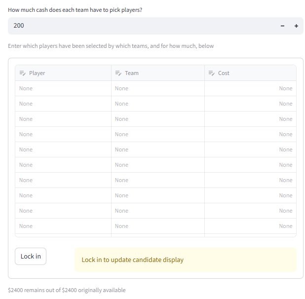
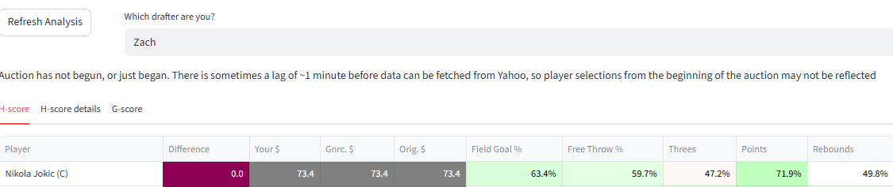
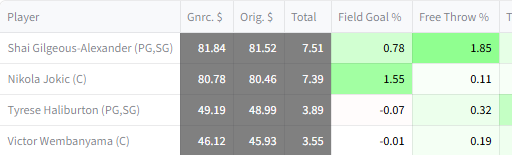
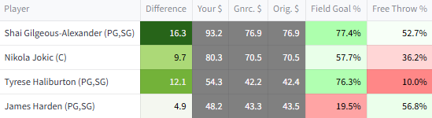

# Auctions 

Auction drafting is more complicated than snake drafting because auction drafters need to decide how much to bid on players, not just which players to take. This level of complexity makes strategizing perfectly for an auction even more impossible than it is for a snake draft. 

Still, quantitative analysis can be helpful in the auction context. In particular, it can be used to benchmark player values in terms of auction dollars. 

The auction mode of this website implements some basic methods for converting G-scores and H-scores into dollar values. It also makes an adjustment to player values that is unique to the auction context called SAVOR.

## Using auction mode 

When the selected mode is 'auction', the website will provide analysis for either synthetic or live auctions. 

### Manual entry 

Player selection information can be entered into the editable table. Analysis will not begin until the 'Lock in' button is pressed; this is to allow for multiple updates without running H-scoring every time. 

### Live connection 

For some reason, Yahoo's API does not return anything for auctions until a few minutes after the auction has started. Because of that, the displayed values may be the default values for the first few picks. 

Once the 'Auction has not yet begun' message is gone, information is being received from Yahoo. 

## Quantifying auction value

A well-known heuristic for quantifying auction value is described in many places including [this article from rotowire](https://www.rotowire.com/basketball/article/nba-auction-strategy-part-2-21393). For reference, it is

1. Calculate the replacement-level score. That is, if 156 players will be chosen, the 157th-highest score is the replacement value
2. Adjust all scores by subtracting out the replacement-level value. If this would make a score go below zero, set it to zero instead
3. Calculate the sum of scores above replacement. This is the total amount of real value available in the auction
4. Divide the total number of dollars available by the total amount of real value available. This yields a conversion rate from score above replacement to dollars
5. Multiply each players' score above replacement with the conversion rate calculated in the previous step. The result is each players' auction value

This process ensures both that players' dollar values proportional to their values over replacement, and that the total of all players' dollar values are equal to the total amount of $ available. 

Auction mode uses this process to quantify player value in a few ways.

### Converting G-score value to dollar value 

Two kinds of dollar values are presented for G-scores

/// caption
G-score-based $ values in a synthetic draft context
///

'Orig. $' value, or original value, is the same as the auction value heuristic described above. Original values do not change during auctions, and can be helpful as objective benchmarks that quantify how good deals are in the abstract. 

'Gnrc. $' value, or generic value, is a variant which is recomputed as players are taken and the amount of available money decreases. For example if two players out of 156 have been taken for $200 total, those two players are removed from the list, the replacement-level value becomes the 155th-highest score, and 200 dollars are removed from the amount of total dollars available. The same process as for original value is then applied using the modified inputs. Generic value may be useful strategically because it reflects whether other managers have been under- or over-spending. E.g. if managers have been underspending, it implicitly takes into account the fact that some managers have excess money and will be able to pay more for remaining players. 

### Converting H-score value to dollar value 

H-scores are probabilities, not general values. They are converted into dollar values with two steps

1. It is estimated how much money it would take to improve winning chances by the same amount as taking the player
2. Those monetary estimates are refined into dollar values with the auction value heuristic as described previously

/// caption
H-score-based $ values in a synthetic draft context
///

The original and generic values are based on players' H-scores converted to monetary estimates for the first pick of the auction, with no players taken and no cash spent. Those are not context-dependent so they stay the same for the whole auction. 

Like for G-scores, the original values are processed once with the auction value heuristic and stay the same throughout the auction. 

For generic values, the underlying step 1 estimates are not changed, but the step 2 process is adjusted for the number of players remaining etc. That is, if a player was estimated to be worth $30 originally, that number will continue to be plugged in as a value to the auction value heuristic process. The auction value heuristic process will be slightly different because players have been taken and cash has been spent. 

H-scoring is also run with with the updated context for the drafter in question. Those monetary estimates become 'Your $' after refinement through the auction value heuristic. The difference between 'Your $' and 'Gnrc. $' highlights players which are more or less valuable to the drafter in question than they are to a generic drafter. 

### The SAVOR adjustment 

After the previously described processing for H-score and G-score dollar values, the website makes an additional adjustment called SAVOR. It is reflected in all of the displayed dollar values. 

SAVOR stands for Streaming-Adjusted Value Over Replacement. It adjusts for the fact that the lowest-ranking players are highly likely to be shuffled around over the course of the season through waiver wires and free agency, so it is not worth spending much money on them, even if theoretically they are projected to be somewhat more valuable than their alternatives. This is a known concept in the fantasy basketball community- for example it is referenced in this [reddit thread](https://www.reddit.com/r/fantasybball/comments/16se6gt/auction_draft_observationsdata/).

Details of the mathematical model behind the SAVOR adjustment are included in the appendix of [an old version of the first paper](https://arxiv.org/abs/2307.02188v4). It was removed from the most recent version because it was not topical. 

SAVOR takes an input parameter, $S_{\sigma}$. It controls the degree to which players are expected to move up and down across the season according to the SAVOR model. Its default value is sourced by vibes- different values may be just as or more reasonable. 

