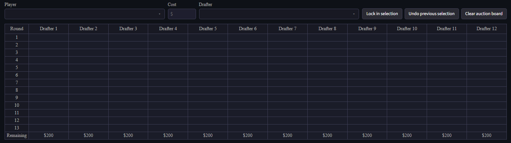
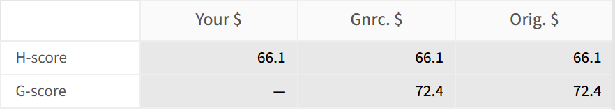
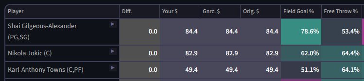
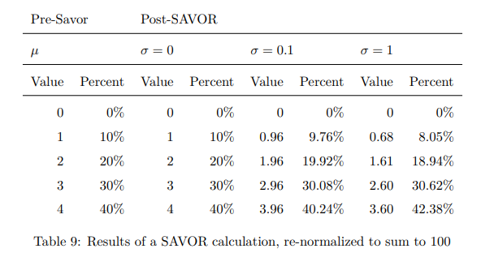

# Auction Mode

Auction drafting is more complicated than snake drafting because auction drafters need to decide how much to bid on players, not just which players to take. This level of complexity makes strategizing perfectly for an auction even more impossible than it is for a snake draft. 

Still, quantitative analysis can be helpful in the auction context. In particular, it can be used to benchmark player values in terms of auction dollars. 

The auction mode of this website implements some basic methods for converting G-scores and H-scores into dollar values. It also makes an adjustment to player values that is unique to the auction context called SAVOR.

## Using auction mode 

When the selected mode is 'Auction', the website will provide analysis for either synthetic or live auctions. 

### Manual entry 

Player selection information can be entered into the table through the selectors above it. 

### Live connection 

Yahoo auctions can be integrated with the website, like drafts. 

For some reason, Yahoo's API does not return anything for auctions until a few minutes after the auction has started. Because of that, the displayed values may be the default values for the first few picks. Besides, that, the integration works much the same way as for drafting mode. 

## Quantifying auction value

The concept of estimating player values for auctions is not new. A well known heuristic is described in many places including [this article from rotowire](https://www.rotowire.com/basketball/article/nba-auction-strategy-part-2-21393). It converts player strength quantified by something like Z-score into an equivalent dollar value, and it is the basis for evaluating players in the auction context. 

??? note "What is the standard auction heuristic?"
    The standard method for estimating auction value is

    1. Calculate the replacement-level score. That is, if 156 players will be chosen, the 157th-highest score is the replacement value
    2. Adjust all scores by subtracting out the replacement-level value. If this would make a score go below zero, set it to zero instead
    3. Calculate the sum of scores above replacement. This is the total amount of real value available in the auction
    4. Divide the total number of dollars available by the total amount of real value available. This yields a conversion rate from score above replacement to dollars
    5. Multiply each players' score above replacement with the conversion rate calculated in the previous step. The result is each players' auction value

    This process ensures both that players' dollar values are proportional to their values over replacement, and that the total of all players' dollar values are equal to the total amount of $ available. 

The website uses a few different variations of this idea. Five different dollar value estimates can be found within players' detailed drop-downs. 

/// caption
All of the computed dollar estimates, from a detailed drop-down 
///

### Converting G-score value to dollar value 

The two $ value estimates for G-scores are the easiest to explain. G-scores are used instead of Z-scores for the reasons discussed in the [G-score](gscores.md) section. 

'Orig. $' value, or original value, is the auction value heuristic described above applied to total G-score on all players in the league. Original values do not change during auctions, and can be helpful as objective benchmarks that quantify how good deals are in the abstract. 

'Gnrc. $' value, or generic value, is a variant which is recomputed as players are taken and the amount of available money decreases. For example if two players out of 156 have been taken for $200 total, those two players are removed from the list, the replacement-level value becomes the 155th-highest score, and 200 dollars are removed from the amount of total dollars available. The same process as for original value is then applied using the modified inputs. Generic value may be useful strategically because it reflects whether other drafters have been under- or over-spending. E.g. if drafters have been underspending, it implicitly takes into account the fact that some drafters have excess money and will be able to pay more for remaining players. 

### Converting H-score value to dollar value 

The dollar estimates based on H-scores are featured more centrally on the website than the estimates based on G-scores. In addition to being available within player drop-downs, the H-score estimates are also shown in the main candidate table. 

The H-score-based estimates are also somewhat more complicated than the G-score equivalents. 

/// caption
H-score-based $ values in a synthetic draft context
///

There are two complicating factors. The first is that H-scores are probabilities, not general values. They are converted into dollar values with two steps

1. It is estimated how much money it would take to improve winning chances by the same amount as taking the player
2. Those monetary estimates are refined into dollar values with the auction value heuristic as described previously

Like for G-scores, the original values are processed once with the auction value heuristic and stay the same throughout the auction. 

For generic values, the underlying step 1 estimates are not changed, but the step 2 process is adjusted for the number of players remaining etc. That is, if a player was estimated to be worth $30 originally, that number will continue to be plugged in as a value to the auction value heuristic process. The auction value heuristic process will be slightly different because players have been taken and cash has been spent. 

The other difference is that H-scores are dynamic and change throughout a draft for each drafter. Beyond just adjusting values for total amount ramining throughout an auction, estimates based on H-scores can also be adjusted for drafting context by running the H-scoring algorithm again.  Re-running the algorithm for the drafter in question and putting the results into the auction value heuristic is how 'Your $' estimates are calculated. The difference between 'Your $' and 'Gnrc. $' highlights players which are more or less valuable to the drafter in question than they are to a generic drafter. For both, the total value across players equals the total dollar value left to be spent, but 'Your $' reacts to the drafter's draft situation while 'Gnrc. $' does not. 

**The long and short of it is: 'Your $' is a reasonable benchmark for what you would be willing to pay for a player. The difference between 'Your $' and 'Gnrc. $' highlights players that are particularly good for your team. The difference between what you might pay and 'Orig. $' tells you whether you got an overall good deal on the player or not, independent of context**

### The SAVOR adjustment 

After the previously described processing for H-score and G-score dollar values, the website makes an additional adjustment called SAVOR. It is reflected in all of the displayed dollar values. 

SAVOR stands for Streaming-Adjusted Value Over Replacement. It adjusts for the fact that the lowest-ranking players are highly likely to be shuffled around over the course of the season through waiver wires and free agency, so it is not worth spending much money on them, even if theoretically they are projected to be somewhat more valuable than their alternatives. This is a known concept in the fantasy basketball community- for example it is referenced in this [reddit thread](https://www.reddit.com/r/fantasybball/comments/16se6gt/auction_draft_observationsdata/).

SAVOR takes an input parameter, $S_{\sigma}$ (S-sigma). It controls the degree to which players are expected to move up and down in dollar value across the season according to the SAVOR model. Its default value of 10 is sourced by vibes- different values may be just as or more reasonable. 

??? note "The theoretical framework behind the SAVOR calculation"

    Details of the SAVOR adjustment are included in the appendix of [an old version of the first paper](https://arxiv.org/abs/2307.02188v4). It was removed from the most recent version because it was not topical to the main point of the paper. 

    The first foundational idea is to model observations of player values as noisy estimates, which are resolved once the season begins. If a player is projected to be valuable before the draft but ends up being below replacement-level during the season, they will be replaced by a replacement-level player. 

    The second foundational idea is that value during an auction is relative to a player that could be picked up at the end for essentially no cost. These players are not useless- it is possible that they could end up being more valuable than projected, and turn into a meaningful asset. 

    Assuming that error between projected and realized value is a Normal distribution with a constant scale allows this situation to be modeled mathematically with relative ease. The result is the following formula 

    $$
    \mu \Phi\left(\frac{\mu}{\sigma}\right) - \frac{\sigma}{\sqrt{2\pi}}\left(1 - e^{-\frac{\mu^2}{2\sigma^2}}\right)
    $$

    This does not lend itself to intuition, but the simple explanation is that as the scale parameter is turned up, players projected to be valuable become even more valuable than their projection. The reason is that the small bump in mean expectation from a low value player versus a tail-end-of-the-auction player doesn't mean as much as a bump in mean expectation for a high-value player, because a significant fraction of the time, the real value of a low-value player will dip below the replacement threshold. That is highly unlikely to happen for high-value players.

    

