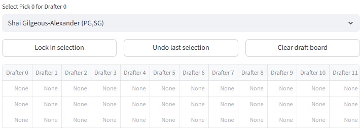
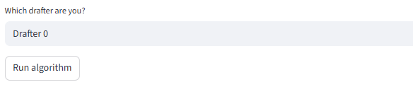
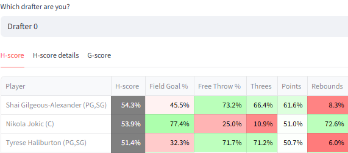
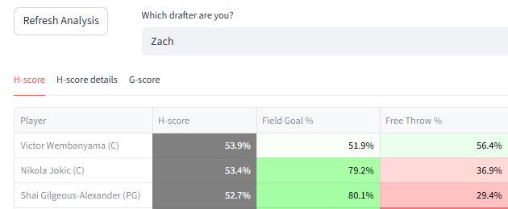

# Drafts

H-scores and G-scores are designed directly for drafts, so they can be applied to drafts without modification.

## Using draft mode

### Manual entry 

With manual entry, draft picks are entered through the website. 

The 'Lock in selection' button puts the player shown in the dropdown into the next draft slot. Picks go in a snake order and cannot be skipped. 

The default order in which players are listed in the dropdown is by total G-score. The top player on the list is the default selection. So if 'Lock in selection' is pressed multiple times in succession, available players are taken in G-score order. 

The table below the player selection dropdown shows which players have been taken by which drafters. 

Tables for G-scores and H-scores of candidate players are shown when the 'Run algorithm' button on the right is pressed. 

The G-score table is available immediately because it is static; the H-scoring table will take some time to fully update. The H-score details tab will also be available, synched to the current display of the H-score table and updated as the algorithm runs. 

### Live connection

With a live connection, draft selections are provided by the platform. The entire screen becomes a view for candidate evaluation. 

The 'Refresh Analysis' button fetches new information on draft picks from the platform and re-runs H-scoring. 

