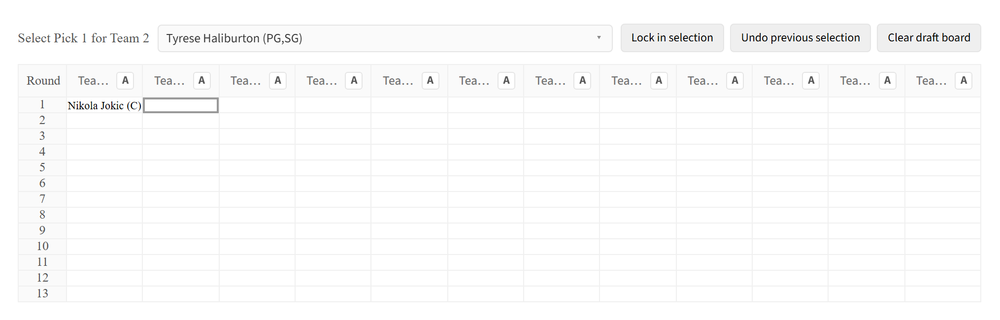
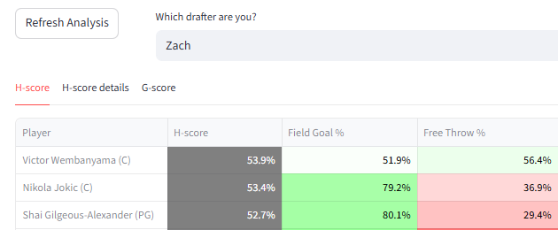
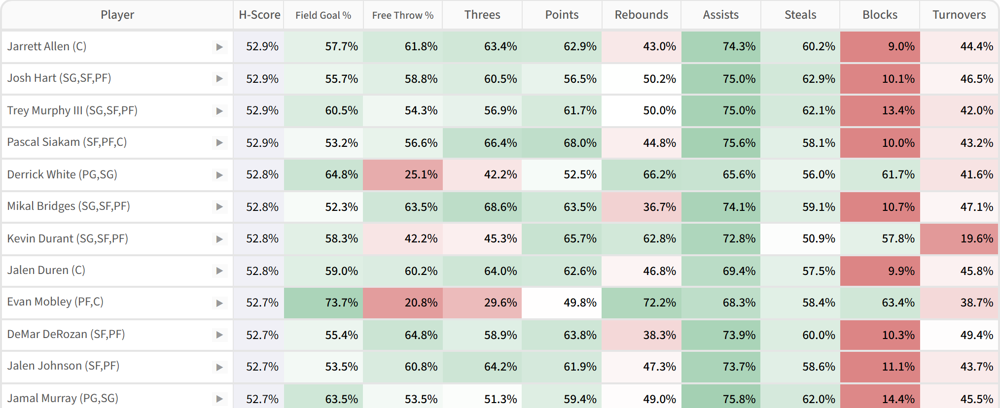
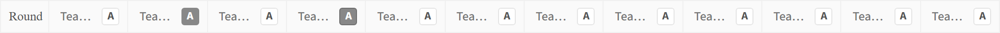
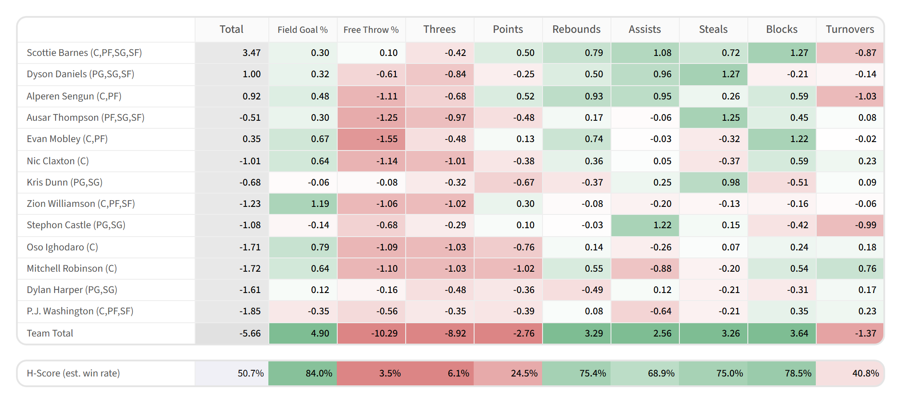
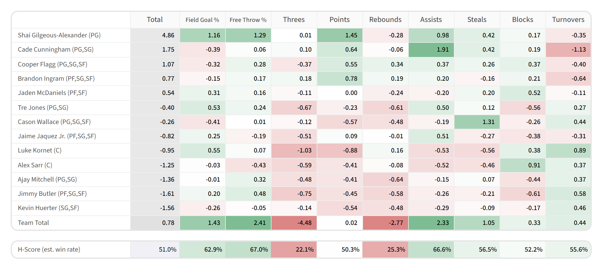

# Draft Mode

H-scoring is primarily designed for drafting,  which allows drafting mode to use a straightforward implementation of the algorithm. 

## Using draft mode 

When the selected mode from the left sidebar is 'Draft Mode', the website will provide analysis for either synthetic or live drafts. 

### Manual entry 

When the data source from the left sidebar is 'Enter your own data', draft picks are entered through the website. 

The 'Lock in selection' button puts the player shown in the drop-down into the next draft slot. Picks go in a snake order (except when there is a third round reversal) and cannot be skipped. 

The default order in which players are listed in the drop-down is by their H-scores on an empty board. The top player on the list is the default selection. So if 'Lock in selection' is pressed multiple times in succession, available players are taken in base H-score order. 

### Live connection

When the data source from the left sidebar is one of the 'Retrieve from ...' platform options, draft selections are provided by the platform. The entire screen becomes a view for candidate evaluation. 

The 'Refresh Analysis' button fetches new information on draft picks from the platform and re-runs H-scoring. 

## Evaluation views 

Under the drafting context, two views are available- the [H-scoring table](hscores.md#main-h-score-table) and the [G-score-based team table](gscores.md#team-table). The H-scoring table shows how candidates stack up, and the team table shows how the team looks so far. 

/// caption
The main drafting view, in the middle of a draft. Switch to the team table by clicking 'Show team statistics'
/// 

These are the main views that can be used to choose players during a draft. 

## Speedup tricks 

For the most part, the website implements the algorithm exactly as it is described on the [H-scoring page](hscores.md). 
The exceptions are a few drafting-specific adjustments to the algorithm which increase processing speed. These "tricks" increase speed significantly, without hurting the robustness of the algorithm in any significant way. 

??? note "What tricks does the website use to speed up the algorithm during drafting?"

    The website uses two tricks to speed up the algorithm for drafting. Both are made possible because for drafting, the top choices are the ones that matter. The difference between the 100th best choice and the 101st is not typically important. 
    
    The two tricks are: 

    - Running candidates through in batches. Typically, the candidates that end up being relevant as choices for a particular drafting situation also score highly by generic H-score (pre-calculated with no drafting context). To get initial results quickly, the top candidates by initial H-score are fed into the algorithm and returned first. Each batch has 100 candidates, ordered by default H-score. When a new batch comes back with data, it is merged into the existing table, pushing new candidates above candidates already-processed when their H-scores are higher. This behavior will almost never be perceptible to the user, since players with low generic H-score ranks are unlikely to jump to the top. It would be difficult to scroll down fast enough to notice this happening. 
    - The position optimization procedure is not run on every iteration for every player. The ideal arrangement of existing players to positions is unlikely to change quickly while small differences are being made to category weights, so optimizing positions every iteration for every player is unnecessary. The top 30 candidates are checked on every iteration, because they are the ones likely to be picked and it costs little to be precise on such a small group. Every other candidate is checked only on full passes that re-solve everyone, once every ten iterations. Which players count as the top 30 is itself recomputed every ten iterations from the latest H-scores, so the exactly-optimized group follows the players that matter for the current draft context rather than a fixed pre-draft list.

## Autodrafting 

In manual entry mode, next to each team name is a button with the letter 'A' in it, for 'Autodrafter'. Click the button to highlight it and make that team an autodrafter. Instead of waiting for a manual input, autodrafters automatically make selections based on H-scoring. 

Autodrafters only look at the top 100 candidates by empty-board base score, because it is extremely unlikely that a player below that would be the best pick, and limiting the analysis to the top 100 offers a substantial speed-up. 

/// caption
Team 2 and Team 3 toggled to autodrafting mode. When Team 1 selects a player, Team 2 and Team 3 will automatically make their picks after
/// 

Teams selected by autodrafting are typically much stronger than those chosen in empty board H-score order, since they form coherent strategies.

/// caption
A team built by an autodrafter around Scottie Barnes at pick 5, 2025-2026, in a full-autodraft field, with a 50.6% H-score. It has a coherent punt strategy, hard-punting both Threes and Free Throw %
/// 

This makes it difficult to maintain a high H-score, even with powerful top picks. 

/// caption
A team built by an autodrafter around SGA at pick 2, 2025-2026, same draft as the Scottie Barnes example. Its H-score is 51.0%. Its punt-three strategy works, but is limited by competition for the best players for that build by the Scottie Barnes drafter
/// 

With all drafters using H-scoring, final H-scores usually settle between 49% and 51%, with early seats scoring on the higher end. 