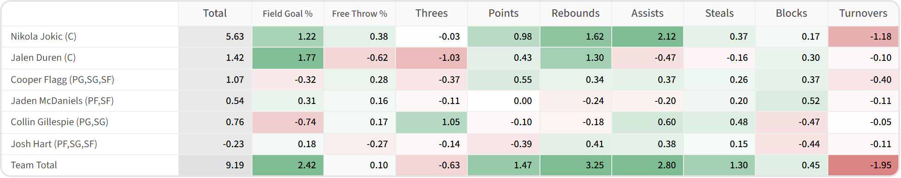

# G-scores 

It is well-understood that player value in category leagues is dependent on context. No single number, independent of circumstances around team, opposition, etc. can ever fully define a player's value. However, that has not stopped fantasy enthusiasts from designing and applying so-called 'static' ranking systems. Despite their limitations in theory, they are useful in practice because they are simple and convenient. One ought not let the perfect get in the way of the good. 

The website uses G-scores as a measure of static value. G-scores are a variant of the traditional Z-score metric, as described in my [first paper](https://arxiv.org/abs/2307.02188).

G-scores are used in a few places on the site. The main one is the team table, which summarizes teams using G-scores

## Team table

The team table shows the G-scores of players already chosen for a team, and their totals. The totals show how the team is doing in general, though one should keep in mind that non-turnover categories tend to have high values during early rounds because only the strongest players are being taken. 

## How G-scores relate to Z-scores

Fantasy basketball's standard way of quantifying player value across categories is the Z-score: a player's projected value in a category, minus the average across the player pool, divided by the pool's standard deviation. Ranking players by their total Z-score across categories is the traditional 'static' approach.

G-scores are a refinement. Z-scores implicitly assume every player performs at exactly their long-term average, but in reality performances vary week to week, and that extra uncertainty makes categories harder to win or lose decisively. G-scores account for it by widening the standard deviation to include week-to-week variance on top of player-to-player variance, which down-weights categories where performances are noisier. The full derivation of why this is the right adjustment is covered in the video and the [first paper](https://arxiv.org/abs/2307.02188).

## Calculation logic 

The definitions of Z-score and G-score are based off a highly idealized version of fantasy basketball, and some thought is needed to calculate them appropriately for a real league. 

One of the inputs needed for the scoring process is a player pool. Using the entire pool of NBA players is a sensible starting point, but significantly flawed because most NBA players do not produce enough to be fantasy relevant. The approach of the website is to calculate scores based on the entire playing pool, then use the top players from that calculation as the player pool for the scores it ultimately calculates. This ensures that parameters like the player-to-player standard deviation are calculated based on players that are somewhat likely to be in real leagues. 

Based on the proxy for the real pool of players and forecasts for their performances, it is easy to calculate player-to-player variance. Week-to-week variance cannot be inferred from forecasts, and instead has to be calculated historically. The website uses historical conversion factors from player-to-player variance to week-to-week variance. 

## Limitations 

G-scores are fundamentally limited because they do not adapt to drafting circumstances. Drafting based purely on total G-score, or any static metric, is a flawed approach. 

With that said, it is worth listing out some of their limitations explicitly 

- Total G-scores have no mechanism for balancing out teams across categories. Drafting purely by G-score can lead to teams which dominate in a small number of categories, and struggle with the rest 

- G-scores cannot encode dynamic strategies like "punting" weak categories 

- G-scores do not account for positional needs. Drafting purely by G-score can lead to teams which are imbalanced across positions

- G-scores are defined based on a projected set of relevant players, which may be inaccurate 

- There are some small assumptions used in the papers to align the G-score definition with the traditional definition of Z-scores. Relaxing these assumptions would lead to slightly different results
