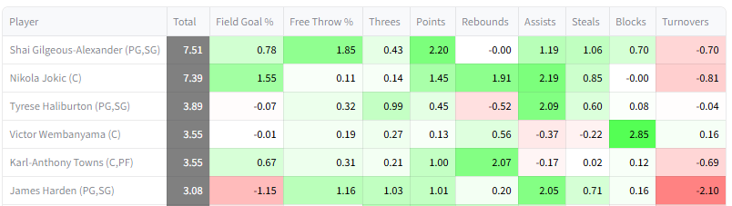

# G-scores 

It is well-understood that player value in category leagues is dependent on context. No single number, independent of circumstances around team, opposition, etc. can ever fully define a player's value. However, that has not stopped fantasy enthusiasts from designing and applying so-called 'static' ranking systems. Despite their limitations in theory, they are useful in practice because they are simple and convenient. One ought not let the perfect get in the way of the good. 

The website uses G-scores as a measure of static value. G-scores are a variant of the traditional Z-score metric, as described in my [first paper](https://arxiv.org/abs/2307.02188). Briefly, they extend Z-scores, which account for player-to-player variance, to account for variance in player performances as well. G-scores can be shown to be approximately optimal for the contrived case of all other players being chosen randomly, which is as reasonable an assumption as any when context cannot be taken into account. They down-weights volatile categories like steals and turnovers relative to Z-scores. 

While limited in terms of flexibility, G-scores may be helpful for understanding a player's strength and weaknesses, seeing how they relate to other players, and ballparking their overall value. 

## G-score table

During auctions and drafts, a tab will be available with the G-score table for available players. The G-score table shows available players ordered by total G-score during drafts and auctions. It includes the categorical components of G-scores as well.

## Team table

The team table shows the G-scores of players already chosen for a team, and their totals. The totals show how the team is doing in general, though one should keep in mind that non-turnover categories tend to have high values during early rounds because only the strongest players are being taken. 

## Calculation

The coefficients for G-scores used by the website were calculated based on real historical data, as shown in [the paper](https://arxiv.org/abs/2307.02188). One should not that real week-to-week variance in historical data is not necessarily the same thing as forecasted variance for future weeks, so the week-to-week variance factor may be too strong or too weak in practice. 