# H-scoring

The heart of the website is an algorithmic framework dubbed H-scoring. It evaluates and ranks potential player picks based on drafting context, as first described in [this paper](https://arxiv.org/abs/2409.09884).

In short, for each candidate player, it optimizes for future draft pick strategy and estimates performance based on those strategies. This allows the algorithm to understand strategic drafting concepts, including 

- Punting (strategically sacrificing) some categories to earn a consistent edge in the rest 
- Prioritizing balance among the categories it chooses to compete in, avoiding "overkill" into categories it already has shored up 
- Considering the opportunity cost of taking roster slots for particular positions 

<!-- Methodology video embeds here, directly under the intro. Left as a comment for now so the guide below stands on its own without it. -->

## Main H-score table

The main H-score table is the focal point of the website. It lists players in order of their H-score rank, along with additional detail.

By default, the H-scoring table applies Head to Head: Each Category scoring. It can be modified for other scoring formats, primarily Head to Head: Most Categories and Rotisserie. It can also modulate between the two Head to Head formats- see the [customizability](#customizability) section for details. 

### Head to Head: Each Category (default)

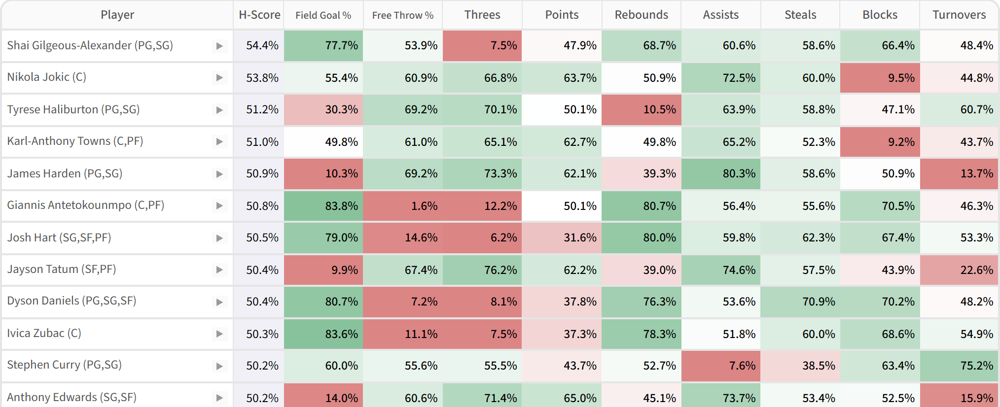
/// caption
Top Each Category H-scores for the first pick, 2024-25 season
///

The overall H-score on the left side of the display is both the metric that H-scoring is trying to optimize with its future draft pick strategy, and the one used to rank players. For Each Category scoring, it is the average expected win probability across categories.

??? note "How does the algorithm optimize the overall H-score?"
    While the spinner is up, the algorithm is iterating, attempting to repeatedly improve its solution. Mathematically, the underlying iteration process is a procedure called Adam. 
    
    Adam is a variant of a statistical procedure called gradient descent. The gradient of a function is derivative over multiple dimensions. As an extremely simple example, the gradient of $x - 3y$ is $1$ in the x direction and $-3$ in the y direction. The gradient gives a hint at which direction the function can be minimized or maximized. The idea of gradient descent is to step in the direction of the gradient (or the opposite direction) to try to find a point which minimizes or maximizes the function.

    <iframe
      width="100%"
      height="450"
      src="https://www.youtube.com/embed/fXQXE96r4AY"
      title="YouTube video player"
      frameborder="0"
      allow="accelerometer; autoplay; clipboard-write; encrypted-media; gyroscope; picture-in-picture; web-share"
      allowfullscreen>
    </iframe>

    Adam performs gradient descent with additional logic around how to scale the step size in each direction. 
    
    Both gradient descent and Adam require an underlying function which has well-defined gradients. The main machinery of H-scoring is the definition of that function. 

    Roughly, the function for H-scoring has three components: category strength expectations, category-level victory probabilities, and the outer-level objective function. The decisions made by the algorithm impact the category strength expectations, which in turn impact category-level victory probabilities, which in turn impact the outer-level objective function. The total gradient relative to an input decision is the gradient of all three steps relative to the previous, multiplied together.

One might note that Giannis Antetokounmpo ranks in the top dozen by H-score. Fantasy veterans will be familiar with Giannis for being undervalued by static ranking systems like overall Z-score, because so much of his value is contingent on punting Free Throw %. H-scoring understands this punting strategy, and evaluates Giannis more appropriately.

The colored numbers to the right are category-level H-scores. They are _not direct reflections of the candidate player's characteristics_. Instead, they show what the algorithm expects the average win rate against all opponents will be, assuming the candidate player is taken. H-scoring calculates those expectations based on not just the characteristics of the candidate player, but also on previously chosen players and potential future picks. The statistics of future picks are estimated based on H-scoring's preferred strategy for future picks.

Because other picks are taken into account, the categorical strengths and weaknesses presented in the H-score table are often quite different from those of the candidate players. For example, Shai Gilgeous-Alexander's row as a candidate for first pick shows a very low probability of winning the Threes category, despite SGA hitting a decent number himself. This is because H-scoring's preferred strategy with SGA involves deprioritizing threes with future picks.

In later draft rounds, the importance of previously chosen players increases and the importance of the strategy for future picks decreases. Also, the strategy for future picks tends to become more stable across players, since the direction of the team is already decided. So categorical H-scores tend to become more consistent across candidate players as the draft goes on.

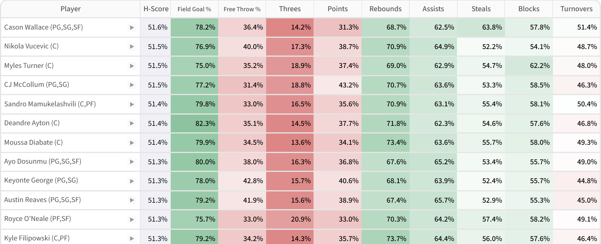
/// caption
Top H-scores for a round seven pick in a mock draft, with relatively stable scores across categories. Each Category, 2024-25
///

Most of the time, the algorithm punts one or two categories, reflected by low H-scores in those categories. For the categories it does not punt, it tries to be above average without going overboard.

??? note "Why does H-scoring punt some categories, while maintaining balance with the rest?"
    The category-based structure of fantasy basketball naturally bifurcates categories into either punting them or slightly over-performing in them. This is due to the fundamental properties of Normal distributions, which are reasonable approximations for sums across many variables. 

    Victory probabilities can be estimated with Normal CDFs based on team-level category averages, thanks to the Central Limit Theorem. Normal CDFs are differentiable; their gradients are Normal PDFs.

    That means that the algorithm implicitly "cares" about categories according to a Normal PDF of category strength. Normal PDFs are thick in the middle and thin on the side, so the algorithm naturally cares most about categories for which it has neutral strength.

    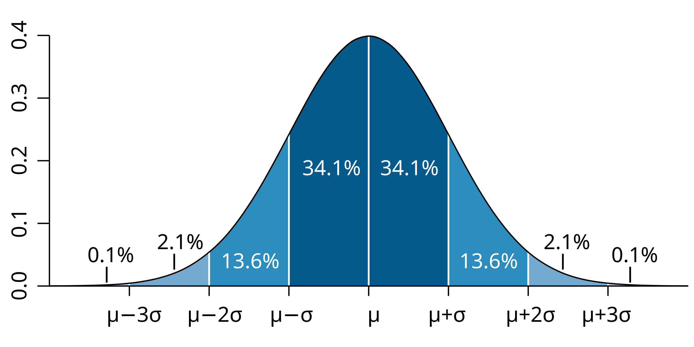
    /// caption
    A Normal distribution, from Wikipedia
    ///

    If a team is strong in a category, the algorithm will deprioritize it. However, this has a negative feedback mechanism; the team will likely get weaker in that category based on future draft picks. It will not try to go overboard and win the category 100% of the time. 

    If a team is already bad at a category, the algorithm will also deprioritize it. In this case, the feedback mechanism is self-reinforcing- the less the algorithm cares about a weak category, the weaker it will be in that category. That creates a snowball effect, which justifies punting as an alternative to competing in a category. 

    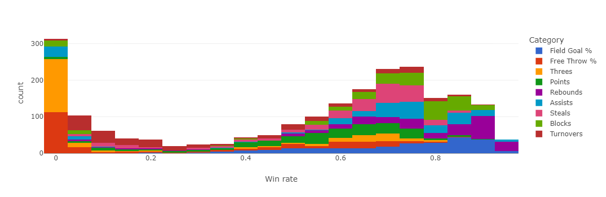
    /// caption
    This image from the second paper shows how the algorithm actually performed on a category level in a simulation. It largely either punted categories or tried to be competitive in them
    ///

    The exact degree to which punting is beneficial depends on many factors- the scoring format, correlations between categories, etc. 

### Head to Head: Most Categories

A basic alternative to Each Category scoring is Most Categories scoring. In Most Categories, teams get wins for every opponent they get a majority of fantasy points against. To reflect that, with Most Categories scoring, the definition of the overall H-score is the probability of winning a majority of categories (assuming they are independent for the sake of making the calculation less intensive).

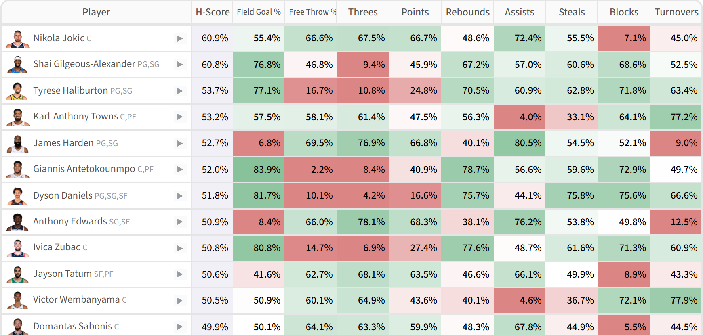
/// caption
Top Most Categories H-scores for the first pick, 2024-25 season
///

The table above is based on the same dataset as the Each Category version. The overall H-scores are different because they are based on the Most Categories objective. With Most Categories scoring, the algorithm is more incentivized to punt, since winning extra categories provides no marginal benefit. This leads to players like Giannis, who benefit greatly from punting, ranking better (eleventh vs. tenth in this case).

??? note "How is Most Categories scoring handled differently from Each Category, mathematically?"
    The scoring format is reflected in the outer-level objective function layer of the H-scoring model. Different formats necessitate different structures for that function, which then drive different behavior for the formats. 

    For Each Category, the objective function is just the sum of probabilities of winning each category. It is relatively simple to calculate, and calculate the gradient of. The probability of winning a category is the cumulative distribution function of the point differential between two teams evaluated at zero. Its derivative is the probability distribution function evaluated at zero. These are both easy to calculate with the approximation that point differentials are Normal. 

    For Most Categories scoring, the objective function is the probability of winning a majority of categories (assuming they are independent), which is more complicated. It is calculated with a dynamic programming approach, calculating probability distributions for winning different numbers of categories out of the first N, then expanding to N+1 etc. It does this simultaneously from both sides.

    The gradient of the MC objective turns out to be the 'tipping point' probability, which is the likelihood that any given category will end up being decisive (multiplied by the base EC gradient). It is calculated in much the same way as the overall MC objective is calculated, with a dynamic programming approach to calculate the tipping point probability for each category. 

With an even number of categories a Most Categories matchup can end level — four each out of eight, for example. By default the website treats that as half a win. It is also possible to declare a tiebreaker category. The tiebreaker category essentially counts for two, which makes the total odd and gives every matchup a winner. 

??? note "Why does counting a category twice behave equivalently to having it as a tiebreaker?"
    Doubling the tiebreaker changes only the level matchups, which is exactly what a tiebreaker should do. Take eight categories, where nine points are then on offer and five are needed. Split them four-four: winning the tiebreaker gives $3 + 2 = 5$ and takes the matchup, while losing it leaves $4 < 5$. Now take a genuine five-three majority: with the tiebreaker among the five, the other four plus two is six; without it, five of the remaining seven is still five. Either way the majority holds. So the doubling settles ties without ever overturning a decided matchup.

    Since the tiebreaker is counted double, it has a different gradient than the other categories. It is decisive either with the total win count of other categories at one less than what is needed or two less than what is needed, so those possibilities are both included in its gradient.  

    Tiebreaker behavior causes complications with understanding what kinds of teams opponents will likely have. It is not reasonable to assume that other teams will be evenly spread across the categories, since the tiebreaker category counts for more. To account for that, the algorithm doubles the baseline weight of the tiebreaker category (also weighted by the EC/MC slider, since total category scoring does not include the tiebreaking mechanism)

### Rotisserie

Rotisserie is another degree more complicated than Most Categories. When the scoring format is Rotisserie, H-scores become an approximation of the probability to win an entire league. 

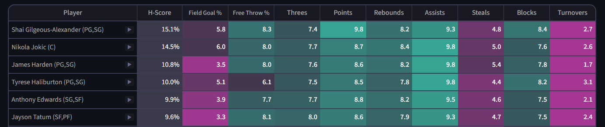
/// caption
Top Rotisserie H-scores, for the 2024-25 season
///

The ranking for Rotisserie is significantly different from both Each Category and Most Categories. Giannis falls out of the top twelve entirely, which aligns with the traditional wisdom that punting is not as advantageous for that format. 

Winning a league is harder than winning a matchup, so H-scores are systematically lower for Rotisserie than for the Head to Head formats. The average is around 8% instead of 50%. 

When the format is Rotisserie, category-level H-scores are expected fantasy point totals per category instead of the likelihood to win a single matchup. One should keep in mind that the expected fantasy point total is just a general average, not what the algorithm expects to happen in a winning scenario. While it may look like it expects some categories to end up below-average, it is still hoping to get lucky and do better than expected in those categories. 

??? note "How does the algorithm work for Rotisserie?"
    The Rotisserie objective is mathematically complicated

    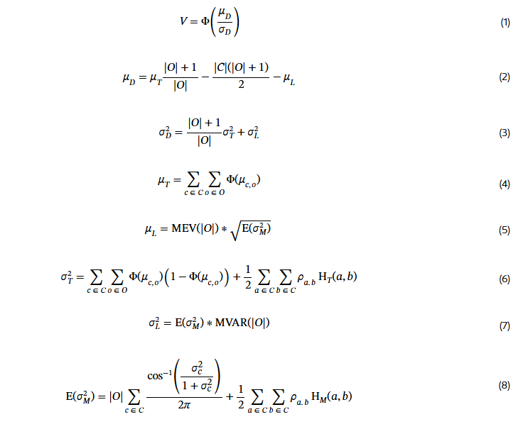
    /// caption
    Too many symbols... and this isn't even the whole thing
    ///

    Roughly, what they are doing is approximating the distribution of the fantasy point total needed to win, and calculating the probability that the team in question will surpass that total. Since the bar is quite high, and an aberrantly good performance is necessary to win, increasing the variance of the team's fantasy point total is benefecial. This motivates a structure which maximizes variance, accomplished by keeping win probabilities around 50-50 (Bernoulli variables have variance $p(1-p)$, maximized at $p=0.5$)

## Detailed drop-down

The main H-score table gives only indirect insight into the strategies that H-scoring wants to use with each candidate player. The H-score details drop-down, triggered by clicking next to a player's name, explains the inner workings of the algorithm for individual players.

### Expectations

The first element of the drop-down is the expectation table. The expectation table breaks down the components of the team on the [G-score](gscores.md) basis, showing how previous, current, and future picks compare to other teams. 

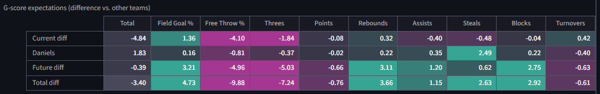
/// caption
Expectations for a team considering Dyson Daniels in round two, having taken Giannis in round one. Each Category, 2024-25
///

'Current diff' represents the G-score differential for the draft so far, including players already drafted in the current round and excluding the candidate player. Teams that have not made their pick for the round are filled in with an estimate of the statistics of their next player. So in this case above, 'Current diff' represents other teams' picks so far vs. a team that has already taken Giannis, with estimates filled in for teams that have not yet drafted. 'Future diff' is the expected difference between future picks made by the drafter and those made by other teams, based on the strategy adopted by H-scoring. In this case the G-score for Free Throws is heavily negative because the algorithm wants to punt it with future picks. 'Current diff' plus the candidate player plus 'Future diff' equals the total differential versus other teams, which H-scoring uses to calculate win probabilities.

'Future diff' depends on the strategy taken by the algorithm for future picks. The elements of that strategy are category weights, flex position weights, and roster allocations, the algorithm's choices for which are shown under the expectation table. 

### Category weights

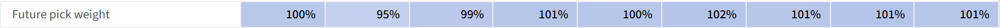
/// caption
Category weights for future picks, for a team considering Daniels after taking Giannis. Each Category, 2024-25
///

The category weightings displayed in the first row are based on H-scoring's internal model of how drafting works. It assumes that the drafter will use those weights exactly for candidates going forward, and it also assumes that those weights will have a certain influence on the aggregate statistics of future picks. Category weights show what the algorithm is thinking in terms of which categories it wants to punt. 

??? note "How does H-scoring pick category weights for future picks?"
    The heart of the algorithm is its treatment of future draft picks. Essentially, it assumes that it will be able to choose from a small slate of available players whose statistical profiles are random, conditioned on the scores being equal in terms of total G-score. It assumes that it will choose the best player available based on its choice of category weights. Using some mathematical estimations, it can calculate the expected deviation from the average for each category based on the category weights. The math behind this is quite complicated...

    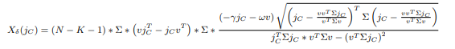
    /// caption
    The mathematical model for how category weights change expected statistics
    ///

    But the basic intuition is that there are two mechanisms at play

    - The more weight the algorithm assigns a category, the higher its picks' expected value for that category will be
    - The more specific kind of player the algorithm is looking for, the more overall value needs to be sacrificed to find that kind of player

    This allows the algorithm to understand that it can prioritize or deprioritize categories with future picks, with some cost to overall value.

In the case above, the weight for Free Throws is perhaps surprisingly high, despite the obvious fact that the algorithm is deprioritizing the category heavily. The reason for this is that in general, the algorithm does not think it needs to adjust weights all that much in order to skew the available candidates to the categories it wants. Its internal model believes that available candidates are very similar to each other in total value, and using extreme weights leads to a decrease in general value. Under this model, it believes that it can achieve a significant skew towards its favored categories without incurring the extreme weight penalty just by shifting weights subtly, so that is what it chooses to do. 

This model is a simplification and does not necessarily resemble the actual space of available players perfectly, so the exact weights should be taken with a grain of salt. The important thing is that the algorithm understands that it can skew categories in the direction it wants in accordance with the correlational structure of player statistics. And the magnitude of that skew has been calibrated via the $\gamma$ and $\omega$ parameters so that it is reasonable. 

### Flex position strategy

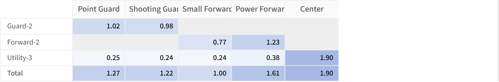
/// caption
Expected flex-spot usage for the same example. The algorithm leans heavily on Power Forwards and Centers. Each Category, 2024-25
///

The flex position allocations show how the algorithm expects to use its flex spots, which can take players of multiple positions. This is relevant because the algorithm understands that different positions have different statistical tendencies. In the Dyson Daniels example above, the algorithm is leaning heavily on taking Power Forwards and Centers with its flex spots, likely because they tend to have poor Free Throw rates, and that synergizes with the strategy of punting Free Throws.

??? note "How does H-scoring decide its positional strategy?"
    The algorithm uses a simple model to estimate how its position strategy will influence its team's category-level strengths. It conceives of the fractional position allocations as expected values of how many players of each position it will take using the flex spots. It then adds average strengths within fantasy-relevant players for each position (normalized to sum to 0 G-scores for each position) multiplied by the flex position shares. This crudely estimates the expected differential driven by position. 

    Modeling flex position decisions as continuous probabilities allows them to be incorporated into the ADAM optimization framework.

### Roster allocation strategy

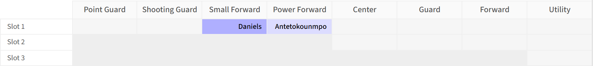
/// caption
Roster assignments for the same example — Giannis slots in at Power Forward and the Daniels candidate at Small Forward. Each Category, 2024-25
///

The algorithm also has some leeway in how it arranges players already taken in terms of position, freeing up different positions to take with future draft picks. The roster assignment row shows what the algorithm is thinking in this regard. In the example above, it is choosing to categorize Daniels as a SF, likely because it does not want to take more SFs in general.

??? note "How does H-scoring decide how to assign positions to players already drafted?"

    Position allocations are binary, and therefore their effects cannot be differentiated. In order to avoid costly mixed-integer optimization, H-scoring treats position allocation as a small sub-problem and solves it independently. Before each round of gradient descent, the algorithm estimates how much it wants a player of each position with future picks, by multiplying the gradients relative to categories (which encode how much the algorithm has to gain from improving in those categories) by the average value of a player of that position. It assumes flex spots are slightly more valuable than the best base position. The algorithm is then allowed to assign previously chosen players to various slots, to free up future position slots for the positions it wants to take players in.

    This kind of problem is called an assignment problem, because slots are being assigned to players. Its reward structure can be encoded into a matrix as shown:

    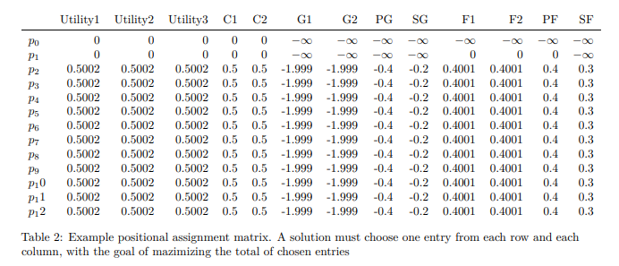
    /// caption
    Example of an assignment matrix from the second paper. Previously chosen players accrue rewards of zero because they have already been chosen. Their reward is set to negative infinity for positions they cannot be assigned to so that the algorithm knows it cannot make those assignments
    ///

    There are fast algorithms available for assignment problems, such as the Hungarian algorithm (though H-scoring actually uses a faster variant).

    <iframe
      width="100%"
      height="450"
      src="https://www.youtube.com/embed/cQ5MsiGaDY8?si=Sq_9ZP9GUnZKL3Ra"
      title="YouTube video player"
      frameborder="0"
      allow="accelerometer; autoplay; clipboard-write; encrypted-media; gyroscope; picture-in-picture; web-share"
      allowfullscreen>
    </iframe>

    After the sub-problem is solved, the algorithm will have a strategy for what positions it wants to prioritize with future picks- e.g. two guards, one shooting guard, and one center. It then knows how many flex spots it has, and can optimize how it allocates them through the general gradient descent process. 

## Customizability

The context in which H-scoring operates is controlled by a handful of settings and parameters in the sidebar.

### Formats and categories

In the parameter interface, the three basic kinds of H-score- Head to Head: Each Category, Head to Head: Most Categories, and Rotisserie- are available through the scoring format toggle and EC/MC slider. This allows for the user to choose any of the three basic kinds of H-scores, or a blend between the two Head to Head scoring systems. 

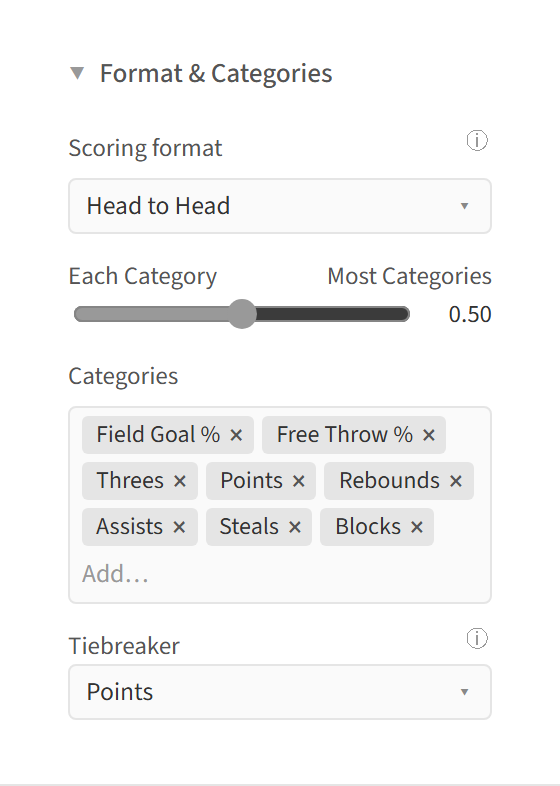
/// caption
The Head to Head controls.
///

The Head to Head formats are paired together because they are comparable, and for some leagues, it might make sense to optimize for both at the same time. The slider defaults to zero, at which point H-scoring optimizes for purely Each Category scoring. If the EC/MC slider is moved all the way to one, it optimizes for purely Most Categories scoring. If the slider is somewhere in between, H-scoring computes and optimizes for both objectives, with weight on Most Categories based on the value of the slider. For example if the slider is at 0.6 it weighs Most Categories scoring at 60% and Each Category scoring at 40%. Setting the slider to somewhere in the middle can make sense for a league that determines regular season standings with Each Category, and does playoffs with Most Categories. 

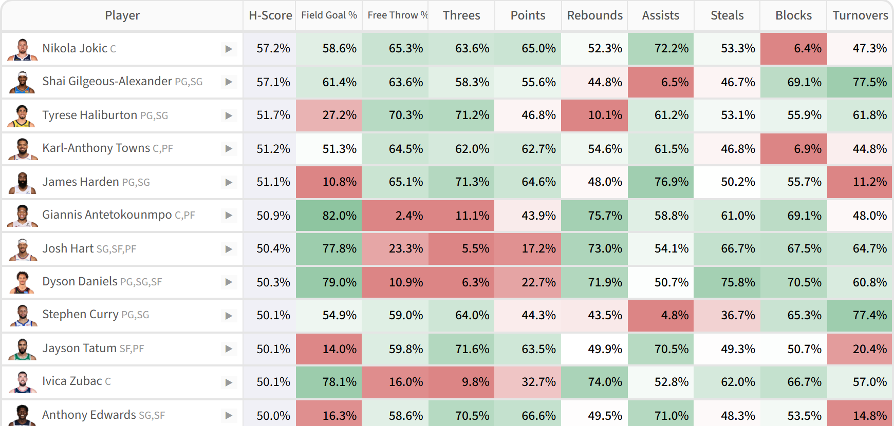
/// caption
H-scores with a half-and-half Each Category and Most Categories objective. The numbers are somewhere between typical Each Category numbers and typical Most Categories numbers 
///

??? note "How exactly are the two kinds of scoring blended together?"
    The objective functions are literally added together with their weights, along with their gradients. This can be justified by considering Most Categories scoring to be equivalent to either winning every category or losing every category. In that case, the expected value of categories won is the probability of winning the matchup times the number of categories for Most Categories scoring, versus the sum of the probabilities of winning each category for Each Category scoring. Dividing each by the number of categories yields the probability of winning a matchup versus the average probability of winning a category, making them sensible objectives to compare. 

For all of the formats, the website supports any combination of categories, across the default nine categories and several alternative options. By default the nine standard categories are selected: Field Goal %, Free Throw %, Threes, Points, Rebounds, Assists, Steals, Blocks, and Turnovers. For the alternative categories, when using projections, make sure to include them when sourcing the projections. ESPN and DARKO do not forecast them so all of the weight will be from Hashtag or BBM projections. 

The tiebreaker option only applies to the Most Categories objective. It becomes available under the category dropdown when the number of categories is even and the slider gives some weight to Most Categories. If weight is given to the Each Category objective as well, the tiebreaker category is ignored for that component. 

### H-scoring parameters

The H-scoring algorithm has three core input parameters- $\omega$ (omega), $\gamma$ (gamma), and the number of iterations- which are configurable by the user through the sidebar. Different parameter choices will lead to different H-scoring results.

$\omega$ and $\gamma$ control how the algorithm thinks about the landscape of player statistics that it will have to choose from in the future. Roughly, when ω is high, the algorithm punts more. The default values (ω = 0.7 and γ = 0.25) were configured based on what worked well in testing against a field of G-score drafters.

The number of iterations essentially determines how many times the algorithm can try improving its results. Theoretically the algorithm will be more precise with more iterations; in practice the default of thirty is probably easily enough.

### Position structure 

The position structure used by the algorithm — also shown in the [detailed drop-down](#detailed-drop-down) — is configurable by the user.

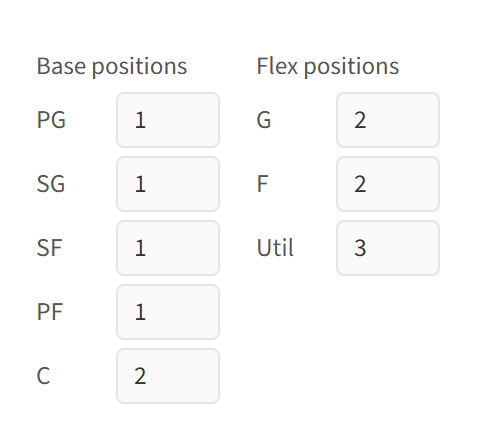

It is important to note that this position structure should not necessarily be the same as the league's position structure. The league position structure might include bench slots which players can be moved in and out of on a day-to-day basis to make their games count. Players sitting on that kind of bench do matter, so long as the team is balanced enough in terms of position to accommodate all the players who are active on a given day. Those bench slots should be included as Utilities, or perhaps extra Guards or Forwards to ensure adequate balance. The proper configuration will depend on the rules of a league and some degree of personal preference. 

## Limitations and corrections

H-scoring as presented in the papers has numerous limitations. The website does have some procedures in place to mitigate these limitations, but they are imperfect and not comprehensive. 

### Reliance on one projection set 

H-scoring as described by the papers is fully reliant on a single set of projections. If another drafter takes a player projected to be a poor performer highly, the algorithm will not "doubt itself" and consider the possibility that its projections for that player are too low. It will assume that pick was a poor choice and the drafter who took it will have a bad team. 

This inability to doubt itself makes the algorithm overconfident, believing that its own team is very strong, when its own projections are not necessarily better than those implicitly used by other drafters. As a practical matter this can lead the algorithm to think its team is so strong that the only way to improve is to "un-punt" categories it has given up on, which is probably a bad idea in practice. 

The papers assume that player projections are all known and agreed upon by all the drafters, so they don't address this issue. However, it is so important in practice that the website has its own logic to address it. 

The ℶ (beth) parameter controls the influence of the adjustment. Higher values of ℶ more aggressively regress the strength of the team towards the average. It defaults to 3. An adjustment is made to the algorithm's assessment of its team's strength for any pick after the first.

??? note "The math: how the adjustment is computed"
    Say that $w$ is a vector of the algorithm's naive guess at how likely it is to win each category, before performing gradient descent to optimize a future strategy. Corrected versions are calculated as

    $$
    w^* = \left[ I_{n \times n} + \frac{\beth}{ n^2}\mathbf{1}_{n \times n}  \right]^{-1} \left[ w + \frac{\beth}{2n} \mathbf{1}_n \right ]
    $$

    Where $n$ is the number of categories and ℶ is a parameter. The intuition on what this expression is doing is not immediately clear, but some intuition can be gleaned from the justification below. 

    These corrected win rates are then used to reverse engineer an adjusted expectation of the team's current strength, like so: 

    $$
    x^* = \text{CDF}^{-1} \left( w^* \right)
    $$

    Since this adjustment is made before any gradient descent is performed, as the punting strategy changes, the algorithm's opinion of its own team does not change. Re-adjusting the win rates for every iteration of the algorithm based on the current expected win rates would implicitly change the algorithm's opinion of its pre-existing team based on its strategy for the future, which does not make much sense. 

The justification for this adjustment is a Bayesian model for updating expectations of team strengths, given drafting decisions made by all drafters. 

??? note "The math: the Bayesian justification"
    Say that there are prior expectations that 

    - H-scoring's estimates for how often it will win a category are unbiased, but have some Normally distributed error $\epsilon_a$. 
    - The team's true average win rate across all categories is a random variable with mean 50% and Normally distributed error $\epsilon_b$. 

    This information provides a Bayesian framework for re-calculating adjusted category-level win rates. 

    By Bayes' rule, the probability of a certain set of category win rates being correct is proportional to its likelihood times the prior. In this case, the likelihood is 

    $$
    \prod_c \phi (\frac{w^*_c - w_c}{\epsilon_a})
    $$

    And the prior probability is 

    $$
    \phi \left( \frac{\frac{ \sum_c \left( w^*_c - \frac{1}{2} \right)}{n}}{\epsilon_b} \right) = 
    \phi \left( \frac{ \sum_c \left( w^*_c - \frac{1}{2} \right)}{\epsilon_b n} \right)
    $$

    Multiplying them together yields 

    $$
    \left[ \prod_c \phi \left(\frac{w^*_c - w_c}{\epsilon_a} \right) \right] \left[ \phi \left(\frac{ \sum_c \left( w^*_c - \frac{1}{2} \right)}{\epsilon_b n } \right) \right]
    $$

    Taking the natural logarithm of both sides (converting to log odds) simplifies the expression to 

    $$
    \left[ \sum_c \left(\frac{w^*_c - w_c}{\epsilon_a} \right)^2 \right] +  \left(\frac{ \sum_c \left( w^*_c - \frac{1}{2} \right)}{\epsilon_b n} \right)^2 
    $$

    To optimize this, the derivative is set to zero. Applying the chain rule for category d results in

    $$
    0 = 2 \left(\frac{w^*_d - w_d}{\epsilon_a} \right) \frac{1}{\epsilon_a} + 2 \left(\frac{ \sum_c \left( w^*_c - \frac{1}{2} \right)}{\epsilon_b n} \right) \frac{1}{\epsilon_b n}
    $$

    Isolating $w^*_d$- 

    $$
    2 \left(\frac{w_d}{\epsilon_a^2} \right) - 2 \left(\frac{ \sum_{c \neq d}  \left( w^*_c \right) - \frac{n}{2}}{\epsilon_b n} \right) \frac{1}{\epsilon_b n}= 2 \left(\frac{w^*_d}{\epsilon_a} \right) \frac{1}{\epsilon_a} + 2 \frac{w^*_d}{\epsilon_b^2 n^2}
    $$

    $$
    2 \left(\frac{w_d}{\epsilon_a^2} \right) - 2 \left(\frac{ \sum_{c \neq d}  \left( w^*_c \right) - \frac{n}{2}}{\epsilon_b n} \right) \frac{1}{\epsilon_b n}= w^*_d \left( 2 \frac{1}{\epsilon_a^2} + 2 \frac{1}{\epsilon_b^2 n^2} \right) 
    $$

    So 

    $$
    w^*_d = \frac{\frac{w_d}{\epsilon_a^2} - \left(\frac{ \sum_{c \neq d}  \left( w^*_c \right) - \frac{n}{2}}{\epsilon_b^2 n^2} \right) }{\frac{1}{\epsilon_a^2} + \frac{1}{\epsilon_b^2 n^2}}
    $$

    With $\beth = \frac{\epsilon_a^2}{\epsilon_b^2}$, this is 

    $$
    w^*_d = \frac{w_d - \beth \left(\frac{ \sum_{c \neq d}  \left( w^*_c \right) - \frac{n}{2}}{ n^2} \right) }{1 + \frac{\beth}{ n^2}}
    $$

    This expression is the best for gleaning intuition behind the adjustment. When the average win rate is high, a larger quantity is subtracted out from all the win rates. If the win rates are all 50%, the numerator becomes $\frac{1}{2} + \frac{\beth}{2n}$, cancelling with the denominator and keeping win rates 50%. Higher values of $\beth$ increase the importance of the distortion term and decrease the importance of the original win rate.

    While being relatively interpretable, this expression unfortunately cannot be used directly because all of the $w^*_c$ values are unknowns. Some linear algebra is required with the vector forms of $w$ and $w^*$. 

    With $J$ as matrix with $0$ on all diagonals and $1$ on all non-diagonals, the equation can be written 

    $$
    w^* = \frac{w - \frac{\beth J_{n \times n} w^*}{n^2} + \frac{\beth}{2n}\mathbf{1}_n }{\left( 1 + \frac{\beth}{ n^2} \right)}
    $$

    Or 

    $$
    \left( 1 + \frac{\beth}{ n^2}\right) I_{n \times n} w^* = w - \frac{\beth J_{n \times n} w^*}{n^2} + \frac{\beth}{2n} \mathbf{1}_n
    $$

    Isolating $w^*$ yields 

    $$
    \left[ \left( 1 + \frac{\beth}{ n^2}\right) I_{n \times n} + \frac{\beth}{ n^2}  J_{n \times n} \right] w^* = w + \frac{\beth}{2n} \mathbf{1}_n
    $$

    The $J$ can be simplified out 

    $$
    \left[ I_{n \times n} + \frac{\beth}{ n^2}\mathbf{1}_{n \times n}  \right] w^* = w + \frac{\beth}{2n} \mathbf{1}_n
    $$

    Finally, the matrix can be inverted to yield an expression for $w^*$

    $$
    w^* = \left[ I_{n \times n} + \frac{\beth}{ n^2}\mathbf{1}_{n \times n}  \right]^{-1} \left[ w + \frac{\beth}{2n} \mathbf{1}_n \right ]
    $$

### Only one strategy is evaluated 

Fantasy basketball analysts often advocate for taking the best player available for the first few picks, and waiting until later to commit to a punt. The idea is to start flexibly, and decide which categories to punt based on which star players end up on the team. A manager would not want to commit to e.g. punting blocks before a star shot-blocker falls into their lap. 

Ideally, the algorithm would model a probability distribution of how circumstances could change, and choose a strategy based on expected value. Instead, for practical reasons, the algorithm is designed to maximize the best strategy under a point estimate of how its strategies would turn out. The lack of understanding of alternate scenarios is a weakness of H-scoring. It does not consider a spectrum of possibilities, so it does not know which strategies are resilient and which are flimsy. 

In general, the flexibility of a strategy is highly related to the degree of punting it involves. A drafter who is only softly planning on punting blocks is likely able to take advantage of a surprising shot-blocker more easily than a drafter planning on hard-punting the category. This motivates a regime of rewarding balance for early picks. The algorithm does this with a technique called regularization, which adds a small penalty for moving category weights into H-scores. The algorithm can still plan on a punt, but regularization incentivizes it to punt less harshly, and to choose players who rely less on punting specific categories for their value. This allows the algorithm to more easily pivot if the draft proceeds in a surprising way. 

The strength of that pull is the λ (lambda) parameter in the sidebar, which defaults to 0.05. Raising it makes early picks hedge harder: weights stay nearer balanced, and the algorithm prefers players whose value does not depend on any one punt landing. Lowering it lets the algorithm commit sooner, which pays off when the punt it picks is the right one and costs flexibility when it is not. Setting it to zero removes the pull entirely, leaving the algorithm free to commit from the first pick.

λ is also scaled by a diminishing factor as the draft goes on. This ensures that regularization applies most for early picks; once the algorithm settles on a strategy, it stops applying as much. 

??? note "How does the website enforce regularization?"
    The algorithm regularizes by incorporating an L1 penalty on the difference between category weights and what they would be for standard G-scoring, plus an equivalent mechanism for flex positions. This encourages balanced strategies without overly penalizing punt strategies for players who rely on them. 

    The L1 penalty weight decreases as the draft continues, since the importance of flexibility goes down as the team's shape becomes more defined. It goes down as a function of the Gaussian PDF. Specifically, the weight for pick $n$ is $\lambda$ multiplied by the phi function evaluated at $\frac{4n}{k}$ where $k$ is the total number of players to be picked. The hand-wavy motivation for this form of the decay schedule is that as teams stray from average, the probability they will snap back to average with Normally distributed players is roughly Gaussian. In practice, this decay schedule works because it is strong for the first few rounds and tapers to be very small as the draft continues. 

    The flex position regularizer has the same scheduler, just scaled up because the flex position numbers tend to vary more. 

### No model of other managers

The internal logic of the paper's version of H-scoring does not understand that other drafters may also be trying to punt categories. This will lead to inaccurate projections of other teams and inaccurate projections of which players will be available in later rounds.

The website's version of the algorithm has a few ways of dealing with this. Predicting the choices of other fantasy managers is difficult because each one has their own habits. Some will punt aggressively, some will prioritize balance, some will chose players from their favorite teams, etc. So the algorithm doesn't try to get in every manager's head; it uses a few heuristic strategies instead. 

The first is a way of predicting what other teams will look like. Before running H-scoring on all candidates, the algorithm is run on a small subset of the top players, and the expected final statistics for each player's team are recorded. That process iterates, with each successive pass reacting to all previous ones. By the end, the algorithm has a rough picture of what an equilibrium might look like in terms of opposing team strategies. Then, during a draft, the algorithm continues to update its expectations by running H-scoring for opponents, and keeping track of what the algorithm expects from future picks for each opponent. 

The strength of the applied prediction is controlled by the C (confidence) parameter in the sidebar. For Head to Head formats it defaults to 0.5, which halves the adjustment to expected team statistics; the purpose of that softening is to prevent overconfidence about exact punting builds. Rotisserie always uses full confidence, so the control is hidden there — there is no equivalent uncertainty about punting in Rotisserie, where the main strategy other drafters are expected to adopt is shoring up reliable categories, which is consistent and stable. 

Testing confirms that the prediction adjustment improves the performance of H-scoring against other H-scoring drafters, while degrading performance against pure G-score drafters. Setting C to zero turns the prediction off entirely: every other drafter is treated as a neutral picker with no strategic tendencies.

While the first fix handles the expectations of what other teams will look like, it does not account for how the field of available players changes based on what other drafters are doing. If a punt is strong and likely to be popular, other drafters will compete for players who fit that punt build well, making it more difficult to succeed with the build. The algorithm handles that with the κ (kappa) factor, which subtly discourages the algorithm from using potentially popular punting strategies. It observes which categories are popular to punt during the self-play process, and adds small punishments for punting those categories, scaled by the value of κ. This is to make the cost of competing for a crowded punt explicit. The default value of κ is $0.3$.

Another way to account for other managers' behavior is modifying the H-scoring parameters. When autodrafters play against each other, the optimum values for $\omega$ and $\gamma$ are approximately $0.5$ and $0.1$, respectively, with κ set to $0.3$. This setting leads to slightly less aggressive punting than the default parameters, which are designed to do well against managers who do not punt. Punting less aggressively against strategic managers is likely appropriate because there is more competition for the best players for punt builds.  

??? note "How do we know what the optimal parameters are for H-scoring agents against other H-scoring agents?"

    The optimal values were found via a self-play experiment: across thousands of simulations of different seasons, a full league of identical H-scoring agents drafted against each other, slightly perturbing their parameters each time. Simulations were paired such that each one would have two drafters with a positive $\omega$ perturbation, two with a negative $\omega$ perturbation, etc. and the other simulation would have the same drafters moving in the opposite direction- Spall's method with antithetic variates. After each pair of simulations, the success of the perturbations was judged, and the parameter stepped in the direction that produced better results. This kept going until there was no clear better direction, meaning that the parameters were at a symmetric equilibrium, in which no agent could improve by unilaterally changing its own parameters.

    This procedure repeatedly settled near $\gamma \approx 0.1$ and $\omega \approx 0.5$, with κ free to vary landing near $0.3$ — consistent with the recommendation above, since a field of H-scoring agents is itself a punting field. To confirm the result was a genuine optimum rather than a degenerate local trap, a Head to Head test of these parameters against the defaults was also run; the tuned parameters won consistently, ruling out a bad basin. 

    These parameters specifically work well in the H-scoring vs H-scoring context. Against G-scores, a similar procedure yielded parameters close to the defaults of $\omega \approx 0.7$ and $\gamma \approx 0.25$.

### Gradient descent optimizes locally

A fundamental limitation of gradient descent is that it only looks for nearby peaks, potentially missing peaks that are further away. In fantasy basketball terms, it can optimize a build but not evaluate the idea of totally switching to a new build. 

For Each Category and Most Categories, the website mitigates this flaw by choosing its starting point carefully for the first few picks. It checks the objective function in the direction of each punt, and starts its hill-climbing in the neighborhood that scores the best. In practice, this usually aligns the algorithm with the best possible punt. For picks after the first few, it is no longer necessary to prove every punt, because the team already has a defined shape. The algorithm instead starts with the build it settled on for its previous pick. 

Punting is less common in Rotisserie, so gradient descent does not start at a punt. Instead it starts at a neutral position, slightly tilted towards categories that are robust like Points and Assists. That's where the Rotisserie algorithm generally wants to go, since it thinks it can rely more on luck for the unstable categories like Steals and Turnovers. 

??? note "How does the website check multiple punts?"
    The website checks potential punts by calculating the current objective function with one category at a time set to 90% of its neutral weight. The weight distribution that evaluates to the highest score becomes the starting point for gradient descent. 

    Normally, multi-start gradient descent would perform gradient descent on each starting point. In this case, that is relatively unnecessary, because the strength of the simple punting strategy is highly indicative of which punt has the best optimal point. It also accounts for punting multiple categories natively, because once in the direction of one punt, the algorithm can see promising punts to pair it with. In testing, this procedure found essentially the same solutions as starting with many random points and performing gradient descent from all of them. 

### Constant categorical variance

H-scoring does not model category variance based on players. Instead, it assumes that week-to-week variance is the same for all matchups. This is not always accurate, especially when a team is punting a category

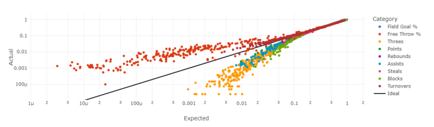
/// caption
Win rates, expected by H-scoring vs. actual, from the paper. There is a clear gap at values below 10% 
///

The paper shows that when hard-punting free throws, teams still win the category surprisingly often. This probably happens because a single poor free throw shooter like Giannis being out can make a team that punts free throws suddenly competitive. On the flipside, teams that punt threes lose even more consistently in the category than predicted. This is because players that don't shoot threes have low variance in how many threes they hit; Rudy Gobert cannot possibly go on a streak from three because he does not attempt them. 

These statistics come from simulations of real seasons using actual player data. Reality is less predictable- players outperform or underperform projections, players get traded or substituted, etc. This increased variance provides a counterbalance to the underprediction for threes. For free throw percent, it compounds, meaning that the algorithm likely underestimates the probability of winning the category despite punting by quite a bit. 

??? note "Why doesn't the algorithm take into account player-level variance?"

    Mathematically, the central reason for the algorithm not taking player-level variance into account is that assuming constant variance makes the math significantly easier. It is what allows the algorithm to think only in the space of differentials- true magnitudes do not matter. 
    
    Another reason is that predicting variance is hard, even ignoring the complicated reality of real fantasy basketball. Most likely, accounting for variance would require individual player-and-category-level forecasts of variance, which would require a massive overhaul of existing forecasting procedures. It might be possible to predict category variance as a function of expected value instead, but that would not necessarily be accurate. 

### Simplified player model 

H-scoring's model for what sorts of players will be available in the future is simplified, and may fail to properly account for individual players with exceptional profiles. 

A classic example of an exceptional profile is prime Ben Simmons, who was an All-Star point guard with a free throw rate barely above 60% between 2019 and 2021. Point guards with low free throw percentages are unusual, and can provide prime opportunities for builds that punt free throws. H-scoring's player model lumps all players together into one giant pile, and so is not aware of particular opportunities for punting like Simmons. 

The best fantasy managers are likely aware of these individual players and how they can be composed into a team. Their insight might help them draft better than H-scoring, especially at the beginning of a draft, before the team has settled on a build. 

### Incomplete fantasy model

The most fundamental flaw of H-scoring is that it does not take into account moves that can be made during an actual fantasy season: streaming players, trading, etc. These introduce considerations that are complex and difficult to incorporate into the drafting process. 

Beyond adding multifaceted strategic considerations to the drafting process, these options also represent important decision points in and of themselves. Expert fantasy managers can greatly improve their chances by making smart moves during the fantasy season. 

The website does have [season mode](season.md) for applying H-scoring during the season, but H-scoring relies on projections, and most expert fantasy managers can move faster than projections when a player becomes poised for a breakout. They also understand schedules and streaming rules. So H-scoring by itself is missing quite a bit when it comes to managing a team throughout a season, and human expertise can outperform it easily on that axis. 