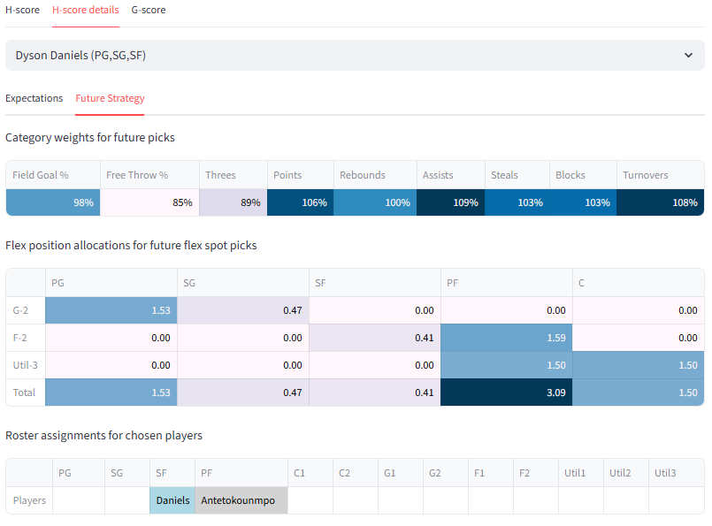

# H-scores

H-scoring is a framework introduced in [the second paper](https://arxiv.org/abs/2409.09884) for dynamic player selection. In short, for each candidate player, it optimizes for future draft pick strategy in terms of category weightings and position allocations, and estimates performance based on those strategies. See the [optimization section](#optimization) for some mathematical detail on how it does that, without the academic rigor of the paper. Because of its ability to adapt to drafting circumstances, H-scoring arguably offers a more compelling and logical starting point for draft strategy than G-scoring. 

The website includes a module which performs the H-score algorithm programatically. 

## Parameter inputs 

The H-scoring algorithm has a few [input parameters](parameters.md/#h-score-parameters) which are configurable by the user. 

### Punting parameters 

/// caption
The punting parameters, available through Algorithm Parameters
///

These two parameters control how the H-scoring algorithm thinks about the landscape of player statistics that it will have to choose from in the future. Roughly, when ω is high, the algorithm punts (strategicially sacrifices categories) more. The default values were configured based on what worked well in testing. 

### Number of iterations

/// caption
The number of iterations parameter, available through Algorithm Parameters 
///

The H-scoring algorithm runs for the specified number of iterations. Additional iterations increase the precision of H-scoring, at the cost of longer computation. In practice thirty iterations, the default, works reasonably well.  

## H-score table

The H-score table for candidate evaluation lists players in order of their H-score rank, along with category-level detail. 

/// caption
Top Each Category H-scores for the first pick, 2024-25 season
///

H-scores change as the algorithm runs. Rendering the results for every iteration would slow down the site, so the table is refreshed once every fifteen iterations. Also, only the top thirty players by H-score are shown until the last iteration, at which point all players are shown. 

One might note that Giannis Antetokounmpo ranks highly by H-score. Fantasy veterans will be familiar with Giannis for being undervalued by static ranking systems like overall Z-score, because he has strong value only with the strategy of sacrificing the Free Throw % category. The H-scoring algorithm is able to account for this and show a more realistic value for Giannis. 

### Category-level H-scores

Category-level H-scores are an in important part of the H-scoring process. Unlike with G-scores, they are _not direct reflections of the candidate player's characteristics_. Instead, they show what the H-scoring algorithm expects the average win rate against all opponents will be, assuming the candidate player is taken. H-scoring calculates those expectations based on not just the characteristics of the candidate player, but also on previously chosen players and potential future picks. The statistics of future picks are estimated based on H-scoring's preferred strategy for future picks.

Because other factors are taken into account, the categorical strengths and weaknesses presented in the H-score table are often quite different from those of the candidate players. For early picks, the most important factor is the strategy for future draft picks. For example, Shai Gilgeous-Alexander's row above for the first pick in the draft shows a very low probability of winning the Rebound category, despite SGA being a decent rebounder himself. This is because H-scoring's preferred strategy with SGA involves deprioritizing rebounds with future picks.

In later draft rounds, the importance of previously chosen players increases and the importance of the strategy for future picks decreases. Also, the strategy for future picks tends to become more stable across players, since the direction of the team is already decided. So categorical H-scores tend to become consistent across players. 

/// caption
Top H-scores for a round seven pick in a mock draft, with relatively stable scores across categories. Each Categories, 2024-25
///

### Overall H-scores

The overall H-score is both the metric that H-scoring is trying to optimize with its future draft pick strategy, and the one used to rank players. It is based on the category-level H-scores. 

For Each Categories scoring, it is defined as the average expected win rate across categories. 

For Most Categories, the average expected win rate is a poor proxy for success. A team that wins five out of nine categories 100% of the time and always loses the others is better for that format than one that wins each category 60% of the time, despite having a lower average expected win rate (56% vs 60%). For that reason, switching the format to Most Categories switches the definition of the overall H-score to the probability of winning a majority of categories (assuming they are independent for the sake of making the calculation less intensive).

/// caption
Top Most Category H-scores for the first pick, 2024-25 season
///

The table above is based on the same dataset as the Each Category version. The numbers, and the order of players, are different because they use the Most Categories objective instead of the Each Category objective. With Most Categories scoring, the algorithm is even more incentivized to punt, and tends to do so to a more extreme degree. Players that benefit strongly from punting like Giannis also end up ranking better (third instead of fifth).

Rotisserie is another degree more complicated than Most Categories. See the [Roto section](roto.md) for details

## H-score details tab

The main H-score table gives only indirect insight into the strategies that H-scoring wants to use with each candidate player. The H-score details tab explains the strategy for individual players more directly. It is broken down into two parts: expectations, and future strategy.

### Expectations

/// caption
Expectations for a team with Giannis as the first pick based on Dyson Daniels as the second, Each Category 2024-25
///

The first row is the same as that from the main H-scoring table, included for convenience. 

The table below breaks down the components of the team, in terms of G-scores vs. the average of other teams. 'Current diff' represents the G-score differential for the draft so far, including players already drafted in the current round and excluding the candidate player. Teams that have not made their pick for the round are filled in with an estimate of the statistics of their next player. So in this case above, 'Current diff' represents other teams' first two picks vs. Giannis, with estimates for other teams that have only drafted one player. 'Future player diff' is the expected difference between future picks made by the drafter and those made by other teams, based on the strategy adopted by H-scoring. In this case the G-score for Free Throws is heavily negative because the algorithm wants to punt it with future picks. 'Current diff' plus the candidate player plus 'Future player diff' equals the total differential versus other teams, which H-scoring uses to calculate win probabilities.  

The ranks show how the candidate player ranks as a pick in this situation, both by H-score and G-score. This can also be seen through the H-score or G-score main tables, and is included here as a convenience. 

### Future strategy

The future strategy tab shows H-scoring's strategy for future picks.

/// caption
Strategies for future draft picks based on having Giannis and Dyson Daniels already, Each Category 2024-25
///

The category weightings displayed in the first row are based on H-scoring's internal model of how drafting works. It assumes that the drafter will use those weights exactly for candidates going forward, and it also assumes that those weights will have a certain influence on the aggregate statistics of future picks. One might note that in the case above, the weight for Free Throws is surprisingly high, despite the obvious fact that the algorithm is deprioritizing the category heavily. The reason for this is that in general, H-scoring does not think it needs to adjust weights all that much in order to skew the available candidates to the categories it wants. 

The flex position allocations show how the algorithm expects to use its flex spots, which can take players of multiple positions. This is relevant because the algorithm understands that different positions have different statistical tendencies. In the example above, the algorithm is leaning heavily on taking Power Forwards and Centers with its flex spots, likely because they tend to have poor Free Throw rates, and that synergizes with the strategy of punting Free Throws. 

The algorithm also has some leeway in how it arranges players already taken in terms of position, freeing up different positions to take with future draft picks. The roster assignment row shows what the algorithm is thinking in this regard. In the example above, it is choosing to categorize Daniels as a SF, likely because it does not want to take more SFs in general. 

## Optimization

Warning- this section is a bit mathy :rotating_light: :abacus: 

H-scoring needs some way of making decisions about category prioritization and position allocation. It makes these decisions through an optimization process, specifically gradient descent. Each iteration of the algorithm is an iteration of gradient descent. 

The gradient of a function is derivative over multiple dimensions. As an extremely simple example, the gradient of $x - 3y$ is $1$ in the x direction and $-3$ in the y direction. The gradient gives a hint at which direction the function can be minimized or maximized. The idea of gradient descent is to step in the direction of the gradient (or the opposite direction) to try to find a point which minimizes or maximizes the function. 

<iframe
  width="100%"
  height="450"
  src="https://www.youtube.com/embed/fXQXE96r4AY"
  title="YouTube video player"
  frameborder="0"
  allow="accelerometer; autoplay; clipboard-write; encrypted-media; gyroscope; picture-in-picture; web-share"
  allowfullscreen>
</iframe>

In order for gradient descent to work, the function to be mazimized or minimized must be differentiable. This motivates the structure of the model behind H-scoring. 

Roughly, the function for H-scoring has three components: category strength expectations, category-level victory probabilities, and the outer-level objective function. The decisions made by the algorithm impact the category strength expectations, which in turn impact category-level victory probabilities, which in turn impact the outer-level objective function. The total gradient relative to an input decision is the gradient of all three steps relative to the previous, multiplied together.

### Category strength expectations: weights 

The heart of the H-scoring algorithm is its treatment of future draft picks. Essentially, it assumes that it will be able to choose from a small slate of available players whose statistical profiles are random, conditioned on the scores being equal in terms of total G-score. Using some mathematical estimations, it can calculate the expected deviation from the average for each category based on weighted preference for categories. The math behind this is quite complicated... 

/// caption
Disgusting! 
///

But the basic intuition is simple. The more weight it assigns a category, the higher its team's expected value for that category will be. This allows the algorithm to understand that it can prioritize or deprioritize categories with future picks. 

### Category strength expectations: position allocation 

The algorithm can also influence expected category strengths by deciding how it expects to divvy up future draft slots in terms of positions. 

Position allocations are binary, and therefore their effects cannot be differentiated. In order to avoid costly mized-integer optimization, H-scoring treats position allocation as a small sub-problem and solves it independently. Before each round of gradient descent, the algorithm estimates how much it wants a player of each position with future picks, by multiplying the gradients relative to categories (which encode how much the algorithm has to gain from improving in those categories) by the average value of a player of that position. It assumes flex spots are slightly more valuable than the best base position. The algorithm is then allowed to assign previously chosen players to various slots, to free up future position slots for the positions it wants to take players in. 

This kind of problem is called an assignment problem, because slots are being assigned to players. Its reward structure can be encoded into a matrix as shown: 

/// caption
Example of an assignment matrix from the paper. Previously chosen players accrue rewards of zero because they have already been chosen. Their reward is set to negative infinity for positions they cannot be assigned to so that the algorithm knows it cannot make those assignments
///

There are fast algorithms available for assignment problems, such as the Hungarian algorithm (though H-scoring actually uses a faster variant).

<iframe
  width="100%"
  height="450"
  src="https://www.youtube.com/embed/cQ5MsiGaDY8?si=Sq_9ZP9GUnZKL3Ra"
  title="YouTube video player"
  frameborder="0"
  allow="accelerometer; autoplay; clipboard-write; encrypted-media; gyroscope; picture-in-picture; web-share"
  allowfullscreen>
</iframe>

After the sub-problem is solved, the algorithm will have a strategy for how what positions it wants to prioritize with future picks- e.g. two guards, one shooting guard, and one center. It then has a degree of freedom in how it allocates the guards between SG and PG, which it optimizes jointly with the decision on how to weigh categories. All of these deviations are added together to produce a model for decision-based adjustments to categorical strengths. 

### Category-level victory probability

Victory probabilities can be estimated with Normal CDFs based on team-level category averages, thanks to the Central Limit Theorem. Normal CDFs are differentiable; their gradients are Normal PDFs. 

That means that the algorithm implicitly "cares" about categories according to a Normal PDF of category strength. Normal PDFs are thick in the middle and thin on the side, so the algorithm naturally cares most about categories for which it has neutral strength. 

/// caption
A Normal distribution, from Wikipedia 
///

This makes intuitive sense and connects with general fantasy basketball strategies. If a team is already bad at a category, it might make sense to abandon that category and punt it, since the team is likely to lose it anyway. That creates a snowball effect- the team gets worse and worse at the category. If a team is extremely strong in a category, it doesn't need the extra help there, and prioritizing it is not important. That does not create a snowball effect, since as the team gets weaker in the category, H-scoring starts to prioritize it more. That means the algorithm is incentivized to put categories into one of two buckets- punting, or competing without going overboard. These are the two traditional approaches to categories in fantasy basketball.

### Outer-level objective function

The outer-level objective function is the function that the algorithm is trying to directly maximize. For H-scoring, it is the overall H-score. 

For Each Category, the objective function is just the sum of probabilities of winning each category. That is relatively simple to optimize, since the overall gradient is just the sum of all the individual gradients.

For Most Categories scoring, the objective function is the probability of winning a majority of categories, which is more complicated. Fortunately, this operation turns out to be differentiable, so it can be optimized via gradient descent. The gradient is the same as for Each Categories except multiplied by a 'tipping point' probability, which is the likelihood that any given category will end up being decisive. 

## H-scoring tendencies

The H-scoring algorithm does not take explicit instructions on overall strategy. However, it "learns" the strategy of punting some categories and balancing others based on its understanding of the problem, as expected. 

/// caption
Image from the paper
///

This image from the paper shows how the H-scoring algorithm actually performed on a category level in a simulation. It shows that H-scoring often punted categories, though the punts were not always total. It often preserved some chance of winning punted categories (this behavior makes intuitive sense- a more detailed discussion is in the paper). For the categories it did not punt, it tried to be highly competitive in them without going overboard. 

## Limitations

H-scoring has numerous limitations. Some of the most major are 

- H-scoring is reliant on a single set of projections which may differ from the beliefs of other managers. Assuming its projections are correct, the algorithm can become overconfident and assess its own team as being so strong that the only way to improve it is to "un-punt" a category. This can lead to late round picks which run counter to the build of a team. The website does have a way to mitigate this, to a degree- see [the page on the Bayesian strength adjustment](projectionadjustment.md/)
- The optimization process for H-scoring only considers one strategy profile. It does not consider how robust players are to different strategy profiles, which may be relevant because circumstances can change during a draft, and the algorithm might switch strategies drastically. 
- The internal logic of H-scoring does not understand that other drafters may also be trying to punt categories. This will lead to inaccurate projections of other teams, and therefore inaccurate projections of expected win rates
- H-scoring does not model category variance based on players. Instead, it assumes that week-to-week variance is the same for all matchups. This is not always accurate, especially when a team is punting a category
- H-scoring's model for what sorts of players will be available in the future is simplified, and may fail to properly account for individual players with exceptional profiles
- H-scoring does not take into account the effect of streaming players, trading, etc. These all may add additional strategic considerations 
