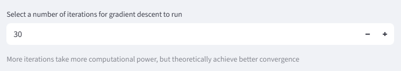
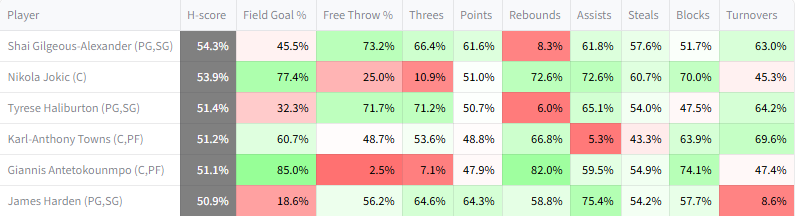

# H-scores

H-scoring is a framework introduced in [the second paper](https://arxiv.org/abs/2409.09884) for dynamic player selection. In short, for each candidate player, it optimizes for future draft pick strategy in terms of category weightings and position allocations, and estimates performance based on those strategies. Because of its ability to adapt to drafting circumstances, H-scoring arguably offers a more compelling and logical starting point for draft strategy than G-scoring.

The website includes a module which performs the H-score algorithm programatically. 

## Parameter inputs 

The H-scoring algorithm has a few [input parameters](parameters.md/#h-score-parameters) which are configurable by the user. 

### Punting parameters 

/// caption
The punting parameters, available through Algorithm Parameters
///

These two parameters control how the H-scoring algorithm thinks about the landscape of player statistics that it will have to choose from in the future. Roughly, when ω is high, the algorithm punts more. The default values were configured based on what worked well in testing. 

### Number of iterations

/// caption
The number of iterations parameter, available through Algorithm Parameters 
///

The H-scoring algorithm runs for the specified number of iterations. Additional iterations increase the precision of H-scoring, at the cost of longer computation. In practice thirty iterations, the default, works reasonably well.  

When the website runs H-scoring, it shows the current results after the first iteration, once every fifteen iterations after that, and after the last iteration. 

## H-score table

The H-score table for candidate evaluation lists players in order of their H-score rank, along with category-level detail. 

/// caption
Top Each Category H-scores for the first pick, 2024-25 season
///

### Category-level H-scores

Category-level H-scores are an in important part of the H-scoring process. Unlike with G-scores, they are _not direct reflections of the candidate player's characteristics_. Instead, they show what the H-scoring algorithm expects the average win rate against all opponents will be, assuming the candidate player is taken. H-scoring calculates that expectation based on not just the characteristics of the candidate player, but also on previously chosen players and potential future picks. The statistics of future picks are estimated based on H-scoring's preferred strategy for future picks.

Because other factors are taken into account, the categorical strengths and weaknesses presented in the H-score table are often quite different from those of the candidate players. For early picks, the most important factor is the strategy for future draft picks. For example, Shai Gilgeous-Alexander's row above for the first pick in the draft shows a very low probability of winning the Rebound category, despite SGA being a decent rebounder himself. This is because H-scoring's preferred strategy with SGA involves deprioritizing rebounds with future picks.

In later draft rounds, the importance of previously chosen players increases and the importance of the strategy for future picks decreases. Also, the strategy for future picks tends to become more stable across players, since the direction of the team is already decided. So categorical H-scores tend to become consistent across players. 

/// caption
Top H-scores for a round seven pick in a mock draft, with relatively stable scores across categories. Each Categories, 2024-25
///

### Overall H-scores

The overall H-score is both the metric that H-scoring is trying to optimize with its future draft pick strategy, and the one used to rank players. It is based on the category-level H-scores. For Each Categories scoring, it is defined as the average expected win rate across categories.

Using the overall H-score to rank players incorporates the strategic concept that player value is dependant on 'build'. For example, Giannis Antetokounmpo typically is rated poorly according to quantitative metrics, because he is dragged down by poor Free Throw shooting. H-scoring sees that it can build a team around him that leans into his strengths, by punting the Free Throw category and prioritizing others. He therefore ends up ranked significantly higher by H-score than he would by pure G-score. 

### Most Categories scoring

For Most Categories, the average expected win rate is a poor proxy for success. A team that wins five out of nine categories 100% of the time and always loses the others is better for that format than one that wins each category 60% of the time, despite having a lower average expected win rate (56% vs 60%). For that reason, switching the format to Most Categories switches the definition of the overall H-score to the probability of winning a majority of categories (assuming they are independent for the sake of making the calculation less intensive).

/// caption
Top Most Category H-scores for the first pick, 2024-25 season
///

The table above is based on the same dataset as the Each Category version. The numbers, and the order of players, are different because they use the Most Categories objective instead of the Each Category objective. With Most Categories scoring, the algorithm is even more incentivized to punt, and tends to do so to a more extreme degree. Players that benefit strongly from punting like Giannis also end up ranking better (third instead of fifth).

## H-score details tab

The main H-score table gives only indirect insight into the strategies that H-scoring wants to use with each candidate player. The H-score details tab explains the strategy for individual players more directly. It is broken down into two parts: expectations, and future strategy.

### Expectations

/// caption
Expectations for a team with Giannis as the first pick based on Dyson Daniels as the second, Each Category 2024-25
///

The first row is the same as that from the main H-scoring table, included for convenience. 

The table below breaks down the components of the team, in terms of G-scores vs. the average of other teams. 'Current diff' represents the G-score differential for the draft so far, including players already drafted in the current round and excluding the candidate player. Teams that have not made their pick for the round are filled in with an estimate of the statistics of their next player. So in this case above, 'Current diff' represents other teams' first two picks vs. Giannis, with estimates for other teams that have only drafted one player. 'Future player diff' is the expected difference between future picks made by the drafter and those made by other teams, based on the strategy adopted by H-scoring. In this case the G-score for Free Throws is heavily negative because the algorithm wants to punt it with future picks. 'Current diff' plus the candidate player plus 'Future player diff' equals the total differential versus other teams, which H-scoring uses to calculate win probabilities.  

The ranks show how the candidate player ranks as a pick in this situation, both by H-score and G-score. This can also be seen through the H-score or G-score main tables, and is included here as a convenience. 

### Future strategy

The future strategy tab shows H-scoring's strategy for future picks.

/// caption
Strategies for future draft picks based on having Giannis and Dyson Daniels already, Each Category 2024-25
///

The category weightings displayed in the first row are based on H-scoring's internal model of how drafting works. It assumes that the drafter will use those weights exactly for candidates going forward, and it also assumes that those weights will have a certain influence on the aggregate statistics of future picks (details are in the paper). One might note that in the case above, the weight for Free Throws is surprisingly high, despite the obvious fact that the algorithm is deprioritizing the category heavily. The reason for this is that in general, H-scoring does not think it needs to adjust weights all that much in order to skew the available candidates to the categories it wants (again, details are in the paper). 

The flex position allocations show how the algorithm expects to use its flex spots, which can take players of multiple positions. This is relevant because the algorithm understands that different positions have different statistical tendencies. In the example above, the algorithm is leaning heavily on taking Power Forwards and Centers with its flex spots, likely because they tend to have poor Free Throw rates, and that synergizes with the strategy of punting Free Throws. 

The algorithm also has some leeway in how it arranges players already taken in terms of position, freeing up different positions to take with future draft picks. The roster assignment row shows what the algorithm is thinking in this regard. In the example above, it is choosing to categorize Daniels as a SF, likely because it does not want to take more SFs in general. 

## H-scoring tendencies

The H-scoring algorithm does not take explicit instructions on overall strategy. However, it "learns" some general strategy based on its understanding of the problem 

/// caption
Image from the paper
///

This image from the paper shows how the H-scoring algorithm generally performs on a category level. It shows that H-scoring often punts categories, though the punts are not always total. It often preserves some chance of winning punted categories. For the categories it does not punt, it tries to be highly competitive in them without going overboard, which may be a wasteful allocation of resources. 

## Limitations

H-scoring has numerous limitations. Some of the most major are 

- The internal logic of H-scoring does not understand that other drafters may also be trying to punt categories. This will lead to inaccurate projections of other teams, and therefore inaccurate projections of expected win rates
- H-scoring does not model category variance based on players. Instead, it assumes that week-to-week variance is the same for all matchups. This is not always accurate, especially when a team is punting a category
- H-scoring's model for what sorts of players will be available in the future is simplified, and may miss individual players with exceptional profiles
- H-scoring does not take into account the effect of streaming players, trading, etc. These all may add additional strategic considerations 

For a full accounting, see the paper. 