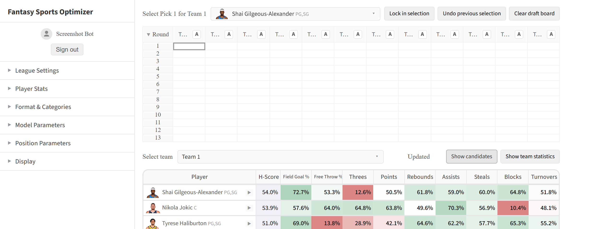

# Fantasy Basketball Optimization

## Introduction

This is documentation for a [website](https://fantasy-basketball-optimizer-281850565831.us-east1.run.app/) which applies an algorithm called [H-scoring](hscores.md) to category-based fantasy basketball. The algorithm provides recommendations for which players to choose based on their statistical profiles and how they synergize with existing teams. 

H-scoring takes two essential inputs. One is [league context](league-setup.md)- which players are getting selected by which teams. The website allows you to either integrate with a real [fantasy league](league-setup.md#fantasy-provider-connections) or [update picks manually](league-setup.md#manual-entry). The other essential input is [player stats](projections.md). When you connect to a platform, those come from external projections; in manual mode you can use external projections too, or data from past NBA seasons. 

The algorithm is primarily designed for [drafting](drafts.md), but can be applied in the context of [auctions](auctions.md) and [ongoing seasons](season.md) as well. 

/// caption
The website in drafting mode, with manual player entry
///

Please note that the algorithm is based on a simplified model of fantasy basketball, ignoring many practical considerations, and there is no guarantee that using it will lead to success. Don't expect to automatically win your league with it or even to have a better shot than anyone else.

## Technical reference 

Source code is available [here](https://github.com/zer2/fantasy-basketball-optimizer). Relevant math is described in these papers: 

- [Improving algorithms for fantasy basketball](https://arxiv.org/abs/2307.02188)
- [Dynamic algorithms for fantasy basketball](https://arxiv.org/abs/2409.09884)
- [Optimizing for Rotisserie fantasy basketball](https://arxiv.org/abs/2501.00933)

## Settings glossary

Settings, available in the left sidebar, control the context in which the algorithm operates.  

| Setting | Options | Explained in |
|---|---|---|
| Mode | Toggle between Draft/Auction/Season modes | [Draft](drafts.md), [Auction](auctions.md), [Season](season.md) |
| Data source | Connect to a platform (Yahoo, Fantrax, ESPN) or enter picks manually | [League Setup](league-setup.md) |
| Drafters and picks | Number of drafters and picks per drafter (manual entry) | [League Setup → Manual entry](league-setup.md#manual-entry) |
| Third-round reversal | Snake-draft order toggle (manual entry) | [League Setup → Manual entry](league-setup.md#manual-entry) |
| Player stats | Configure forward-looking projections, or data from past NBA seasons | [Player Stats](projections.md) |
| Format | Toggle between Head to Head and Rotisserie, and — for Head to Head — slide between scoring each category and winning the majority | [H-scoring → Formats and categories](hscores.md#formats-and-categories) |
| Categories | Select statistical categories for scoring | [H-scoring → Formats and categories](hscores.md#formats-and-categories) |
| Tiebreaker | Define a category to breaks ties for majority scoring with an even number of categories| [H-scoring → Formats and categories](hscores.md#formats-and-categories) |

## Parameter glossary

The website's calculations take a number of user-configurable parameters, available through the left sidebar and explained in relevant documentation sections.

| Parameter | Controls | Explained in |
|---|---|---|
| ω, γ (omega, gamma) | How aggressively H-scoring punts categories | [H-scoring → H-scoring parameters](hscores.md#h-scoring-parameters) |
| κ (kappa) | How strongly the algorithm avoids punting categories that are popular punts for the field | [H-scoring → No model of other managers](hscores.md#no-model-of-other-managers) |
| Opponent sophistication | Whether other drafters are modeled as strategic (punting) drafters or as neutral pickers. A toggle, on by default | [H-scoring → No model of other managers](hscores.md#no-model-of-other-managers) |
| Number of iterations | How long the H-scoring algorithm runs | [H-scoring → H-scoring parameters](hscores.md#h-scoring-parameters) |
| Position requirements | The roster/position structure a team must satisfy | [H-scoring → Position structure](hscores.md#position-structure) |
| υ, ψ (upsilon, psi) | How projections account for injuries and replacement players | [Player Stats → Injury handling](projections.md#injury-handling) |
| ℶ (beth) | How strongly a team's projected strength is regressed toward average | [H-scoring → Reliance on one projection set](hscores.md#reliance-on-one-projection-set) |
| χ, ℵ (chi, aleph) | Rotisserie projection uncertainty and cross-category correlation | [Player Stats → Projection uncertainty](projections.md#projection-uncertainty) |
| $S_\sigma$ (S-sigma) | The spread of auction dollar values across a season (SAVOR) | [Auction Mode → The SAVOR adjustment](auctions.md#the-savor-adjustment) |
| Trade thresholds | Which candidate trades are considered and shown | [Season Mode → Trade suggestions](season.md#trade-suggestions) |
