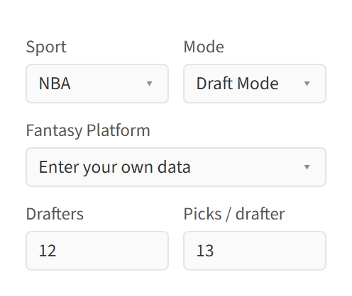
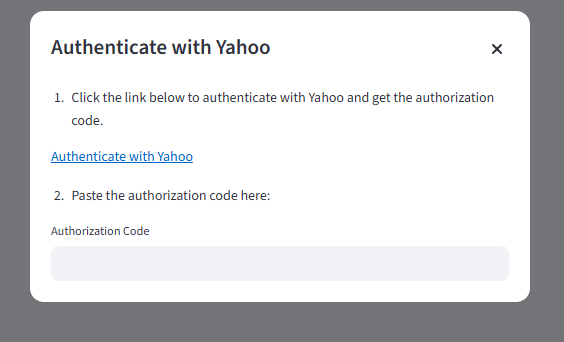
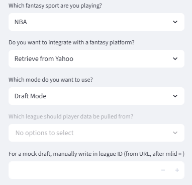
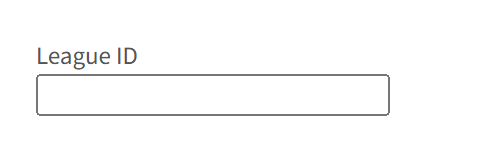
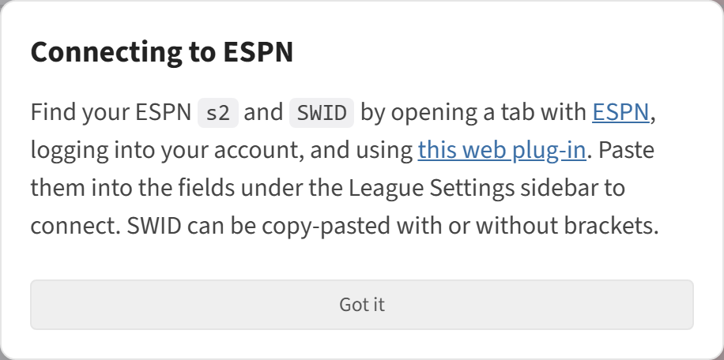
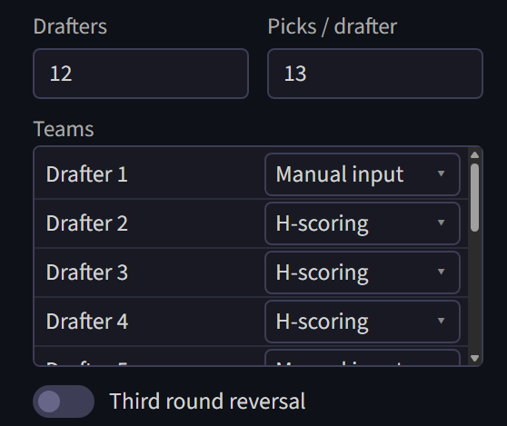

# League Setup

Players chosen by other teams are relevant to the H-scoring algorithm, meaning that the league situation is required context for the algorithm. 

The default option for getting data on drafting situation/teams is entering it manually. 

There is also an option for integrating with a fantasy provider, which allows the website to be used with real fantasy occurring on those platforms. The website will show analysis based on the integrated league. It will never make a pick or take any action itself. 

## Fantasy provider connections

The three platforms currently supported are: 

**Yahoo**: support exists both for pulling existing teams during the season, and for integrating with drafts. This includes mock drafts. To integrate, one must authenticate with Yahoo by following the link on the pop-up generated when Yahoo is selected.

Once the connection is established, relevant leagues will show up, if any. Mock drafts can also be connected to via manually copy-pasting the code for the mock draft.

FYI there is a bug in the wrapper used for connecting to the Yahoo API, which crashes the app when a drafter has a name that is a pure number. 

**Fantrax**: support exists both for pulling existing teams during the season, and for integrating with drafts. However this only works with public drafts. 

**ESPN**: support only exists for pulling existing teams during the season. Unfortunately, ESPN has no API for draft access. To authenticate to pull a team, a web plug-in is needed. The instructions are on the pop-up generated when ESPN is selected. 

## Manual entry

If draft picks are being input manually, a number of additional inputs are required. They are 

- The number of drafters and the number of picks per drafter
- The team names of the drafters and their autodraft settings. Possible autodraft modes are manual entry (the default), H-scoring, or G-scoring. With H-scoring, the algorithm is run for every drafter, which takes some time. G-scoring autodrafting simply chooses players in total G-score order. 
- For snake drafting, a third round reversal toggle. Third round reversal is a common draft setting, wherein the draft order stays the same between the second and third round, instead of snaking. This is designed to limit the advantage of early picks. 
