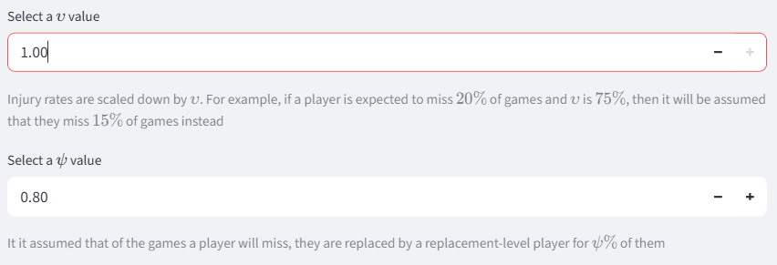
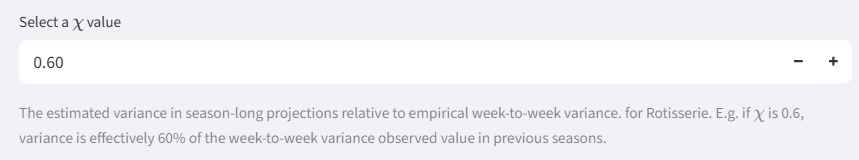
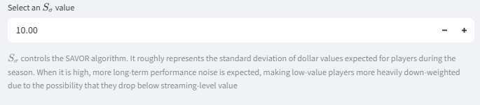
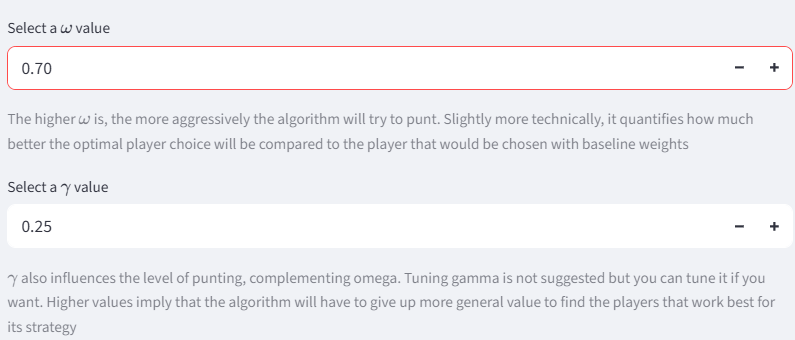
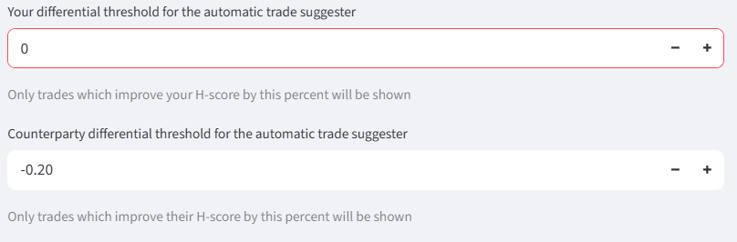
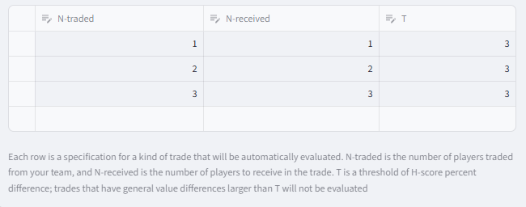

# Parameters

Various calculations performed by the website take in parameters that are configurable by the user. They dictate how injury risk is handled, how aggressively the algorithm will punt, and more. 

## Player stat parameters

### Injury handling 

Projections generally include forecasts of how many games each player will play during the season, but incorporating them into player valuations is not entirely straightforward. 

Typically, player valuations are presented in two ways: per-game values and season total values. Per-game values exclude the missing games, while season total values include them as all zeros. The website allows granular control of the spectrum between those two perspectives, plus an additional correction for players being substituted out for replacement players. 

The first factor, υ, scales injury rates on a spectrum between per-game value and season total values. For example if υ is 0.4 and a player is expected to be injured 10% of the time, that injury rate is adjusted to 4%, and the player's volume projections are multiplied by 96%. A υ of 0 is equivalent to per-game totals, and a υ of 1 is equivalent to season total projections. The argument for setting υ to 1 is that the correct expected value of real player production fully accounts for the probability of injury. The counter-argument is that teams need to be somewhat lucky to have any shot at competing for a championship, so it makes sense for them to strategize with the assumption that their injury luck is reasonably good. The default value for υ is 1, equivalent to season total values.

The second factor, ψ, controls an adjustment for replacement players. It is assumed that when a player misses a game, they will be replaced by a replacement-level player for that game ψ of the time, and that is incorporated into projections after they have been adjusted for injury rates. A replacement-level player has the total G-score value of the Nth-highest player, spread across categories, where N is the number of players in the league.  So continuing the previous example, if ψ is 0.75, then 3% times a replacement player's value is added to the player's projection. The right value for ψ depends on a league's IR rules and how active managers will be in replacing their injured player. It defaults to 0.8.

### Chi factor 

For Rotisserie leagues, an additional parameter called χ is required.

χ controls the estimate of uncertainty in pre-season projections. See the [relevant section on Rotisserie](roto.md/#period-to-period-variance) for more detail. 

## Auction noise

For auction drafts, an additional parameter called $S_\sigma$ is required.

$S_\sigma$ quantifies the standard deviation of dollar values for players throughout a season, which is important for the [SAVOR adjustment](auctions.md/#the-savor-adjustment). Roughly speaking it controls the degree to which low-level players are down-weighted for potentially beocoming irrelevant. 

## H-score parameters

The H-score parameters are inputs to the H-scoring procedure. They control the degree to which the algorithm is incentivized to punt, and how long the algorithm runs for. See the [documentation on H-scoring](hscores.md/#parameter-inputs) for more information. 

## Trade parameters 

The trade parameters limit which potential trades are considered for suggestions. See the [section on trade suggestions](season.md/#trade-suggestions) for the implications of these parameters.

## Position requirements 

H-scoring assumes that either a team conforms to a flexible-enough position structure, or it is invalid. The exact position structure that it checks against is configurable by the user.

Flex slots like Utilities and Guards can be filled by players of multiple different positions. Bench slots are filled by the last players drafted, and do not count for the H-scoring calculations. 

It is important to note that this position structure should not necessarily be the same as the league's position structure. The league position structure might include bench slots which players can be moved in and out of on a day-to-day basis to make their games count. Players sitting on that kind of bench do matter, so long as the team is balanced enough in terms of position to accomodate all the players who are active on a given day. Those bench slots should be included as Utilities, or perhaps extra Guards or Forwards to ensure adequate balance. The proper configuration will depend on the rules of a league and some degree of personal preference. 

