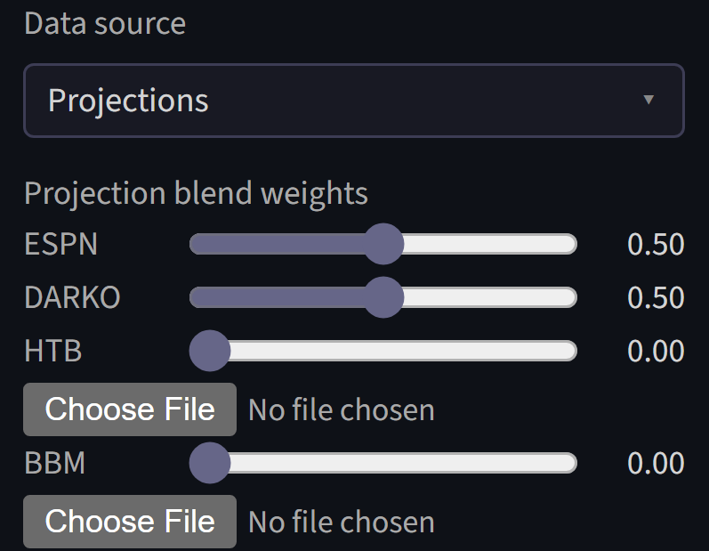
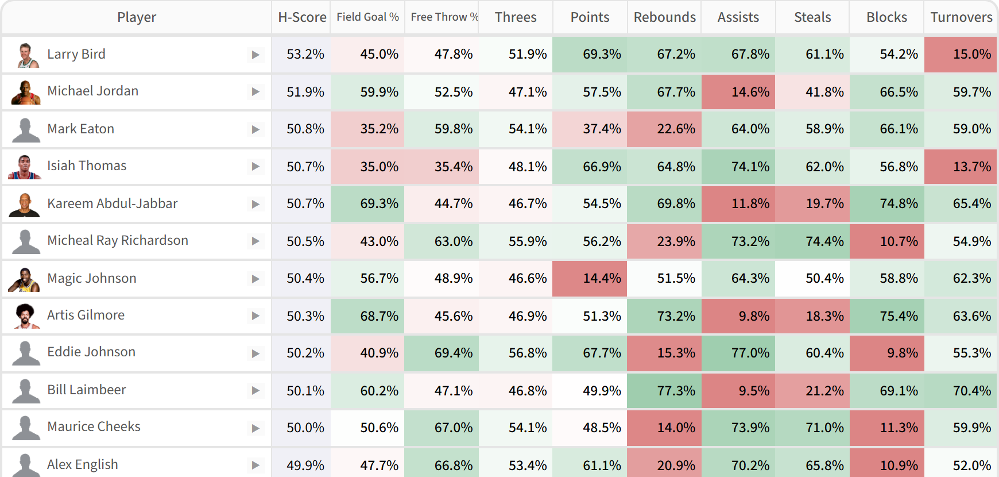

# Player Stats

All of the website's algorithms take player statistics as an input, either from forward-looking projections or historical data. The user can decide which statistics to use. 

The website also processes raw statistics in various ways, accounting for injuries and other factors. Details of these adjustments can be controlled via sidebar parameters. 

## Data Sources

### Projections

The default for player statistics is to use forward-looking projections.

The default projection source is a 50/50 split between ESPN's free forecasts and a modified version of DARKO. The website's version of DARKO projections takes games played and total minutes from the ESPN forecasts, and combines those with DARKO pace and per-possession projections to get per-game projections. This is necessary because DARKO does not forecast games played, and its minute forecasts are designed for the next game only, which is not ideal for fantasy. 

**Note as of December 2025: the ESPN forecasting page currently has bugs, and for that reason the ESPN projections have not been updated since October.**

Any other set of projections can be uploaded, as either a CSV or an Excel file. There is no list of supported providers: the website reads each column on its own and recognizes the common ways each statistic is labelled, so most exports work as downloaded, and a file that already uses the website's own column names always works. Text files are read whatever character encoding they were saved in, so there is no need to re-save them as UTF-8. A file does not need to carry every category either — some providers pair a projection set with a league and export only that league's active categories. Whatever is missing is simply taken from the other sources in the blend, and the upload note says which statistics were absent. If a file is not recognized at all, the error names the headers it could not interpret. Uploaded projections can also be edited by hand before uploading, if you want to adjust individual forecasts.

Two paid products worth mentioning: Hashtag Basketball has no download option, so the projections must be copy pasted into a spreadsheet, which can then be uploaded directly; Basketball Monster's XLSX download can be uploaded as it is. 

Also: be careful to download projections for all players instead of just the top players. During a draft, another drafter may take a player outside of the limited projection list, and the website will only have projections for them if they have been provided. 

Projections are combined between different sources by taking weighted means according to the provided weights. If the assigned weights add up to more or less than 1, they will be scaled to add to 1. 

### Historical data

Historical data from past seasons is available for manual entry drafts. The season selector defaults to the most recent available season.

Historical data is available going all the way back to the 1984-85 season, though for any season before 2000-01 player positions will not be available. 

/// caption
H-scores for the 1984-85 season, Each Category. NP means no position
///

Historical data cannot be used when integrated with a fantasy platform, because platforms do not run leagues based on past seasons.  

## Adjustments 

### Injury handling

Projections generally include forecasts of how many games each player will play during the season, but incorporating them into player valuations is not entirely straightforward. 

Typically, player valuations are presented in two ways: per-game values and season total values. Per-game values exclude the missing games, while season total values include them as all zeros. The website allows granular control of the spectrum between those two perspectives, plus an additional correction for players being substituted out for replacement players. 

The υ (upsilon) parameter scales expected injury rates. At 100%, injury rates are kept intact, equivalent to season total projections. At 0% they are ignored entirely.

??? note "How does υ scale injury rates?"
    υ scales injury rates on a spectrum between per-game value and season total values. For example if υ is $0.4$ and a player is expected to be injured 10% of the time, that injury rate is adjusted to 4%, and the player's volume projections are multiplied by 96%. A υ of $0$ is equivalent to per-game totals, and a υ of 1 is equivalent to season total projections. The argument for setting υ to $1$ is that the correct expected value of real player production fully accounts for the probability of injury. The counter-argument is that managers need to be somewhat lucky to have any shot at competing for a championship, so it makes sense for them to strategize with the assumption that their injury luck is reasonably good. The default value for υ is $1$, equivalent to season total values.

Using season totals has the issue that it assumes missed games are across-the-board 0s, when in reality replacement players can fill in sometimes. When υ is above zero, ψ (psi) credits some of the value back for replacement-level players potentially filling in.

??? note "How does ψ treat the effect of replacement players?"
    The second factor, ψ, controls an adjustment for replacement players. It is assumed that when a player misses a game, they will be replaced by a replacement-level player for that game ψ of the time, and that is incorporated into projections after they have been adjusted for injury rates. A replacement-level player has the total G-score value of the $N$th-highest player, spread across categories, where $N$ is the number of players in the league.  So continuing the example discused above in the υ section, if ψ is $0.75$, then 3% times a replacement player's value is added to the player's projection. The right value for ψ depends on a league's IR rules and how active managers will be in replacing their injured player. It defaults to $0.8$.

### Projection uncertainty

Uncertainty in projections is one of the fundamental factors taken into account by both H-scores and G-scores. The relevant variance is week-to-week in the case of Head-to-Head, and season-long in the case of Rotisserie. 

For Head-to-Head formats, the website uses historical NBA data to estimate week-to-week uncertainty. When the data source is a previous season, it uses data from that season; when the data source is a projection, it uses the most recent year. This is not necessarily exact when using projections, but likely a good proxy.

The Rotisserie algorithm depends on full-season uncertainty instead of week-to-week uncertainty, since that format aggregates scores over full seasons instead of week-by-week. Full-season uncertainty is harder to estimate straight from projection data. It depends largely on how accurate pre-season projections are, which is not well-studied.  

The website's way of handling this is to use scaled week-to-week variance as a proxy for seasonal uncertainty. The χ (chi) factor, which defaults to 60%, controls the degree of scaling.

??? note "How is χ defined?"
    The assumption is that the variance over the ~20 weeks in a season will be χ times the week-to-week variance times 20. If week-to-week variance was the only source of variance, χ would be effectively 22%. It is likely higher than that before the season, because there is uncertainty about rotations, playing time, offseason improvements, etc. 60% is an estimate with essentially no justification, it can be changed as desired. 

### Correlations between categories 

Correlations between categories are an input to the algorithm for Rotisserie. Base correlations are set in the same way as projection uncertainty; calculated from real historical data. 

??? note "Why are correlations considered in the Rotisserie context, but not for other formats?"
    See the [H-scoring section](hscores.md#main-h-score-table) for details on the objective functions used for each format.

    For Each Category, correlations are irrelevant to the objective function. The correlations between categories have no influence on the expected value of their total. 

    For Most Categories, correlations do theoretically matter, since they can influence the probabilities of winning scenarios occuring. Ideally, the algorithm would take them into account. However, calculating the probability of winning scenarios is much harder when factoring in correlations between categories. The Multivariate correlated Normal distribution has no explicit solution, and must be solved with numerical methods. Solving 256 9-dimensional Multivariate Normal CDFs with numerical methods for each player and each iteration is impractical. On the other hand, assuming that categories are independent facilitates the use of dynamic programming to greatly speed up the calculation. And while correlations are not included in the objective function directly, they are included in the model of player statistics, leading the algorithm towards category combinations that tend to be correlated favorably across players. And cross-player correlations are generally similar to correlations for a single player on a weekly level. So the algorithm assumes that the categories are independent for the sake of keeping computations tractable, hopefully without causing a significant distortion. 

    For Rotisserie, ignoring correlations would be problematic. The goal in Rotisserie is to win the entire league, and that requires a certain number of fantasy points. The number of fantasy points needed to win is highly related to the correlations between categories, because the more correlated they are, the more points the luckiest manager would expect to get. Fortunately, H-scoring's approach to Rotisserie is more amenable to incorporating correlations than the approach for Most Categories. Win totals are modeled as Normal distributions, and all that is necessary to calculate the mean and variance of a Normal distribution is the sum of the individual parts and their covariance matrix. This is a much simpler calculation than computing individual winning scenarios separately. 

However, taking historical correlations without adjustment might not be the best choice for simulating real fantasy basketball. In real fantasy basketball, some managers pay more attention than others, leading to some teams having higher volume across the board than would be expected with true randomness. 

The ℵ (aleph) parameter accounts for this by synthetically increasing the correlations between categories that are counting stats. It defaults to 0.2.

??? note "How is ℵ applied?"
    Concretely, ℵ is added directly to the entries of the category correlation matrix that Rotisserie scoring uses, for pairs of counting (volume-based) categories — points, rebounds, assists, threes, and so on. Percentage categories like Field Goal % and Free Throw % are left alone. Each entry is capped at 1, so the already-1 diagonal is unaffected while the off-diagonal correlations rise by ℵ.

