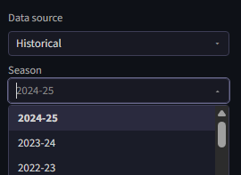
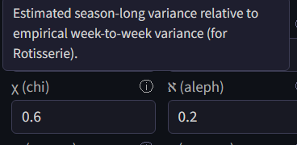
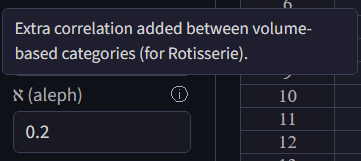
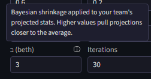

# Player Stats

All of the website's algorithms take player statistics as an input, either from forward-looking projections or historical data. It also makes a few adjustments to them based on user input.

## Projection sources

The default for player statistics is to use forward-looking projections.

The default projection source is a 50/50 split between ESPN's free forecasts and a modified version of DARKO. The website's version of DARKO projections takes games played and total minutes from the ESPN forecasts, and combines those with DARKO pace and per-possession projections to get per-game projections. This is necessary because DARKO does not forecast games played, and its minute forecasts are designed for the next game only, which is not ideal for fantasy. 

**Note as of December 2025: the ESPN forecasting page currently has bugs, and for that reason the ESPN projections have not been updated since October.**

Two additional kinds of forecasts are also available: those created by Hashtag Basketball, and Basketball Monster (BBM). Both of these projections are paid products, so they cannot be provided through the website. Instead, they must be purchased and uploaded. For HTB, there is no native download option for projections. The projections must be copy pasted into an Excel file and saved as a CSV. For BBM, there is a download option, but only the XLSX download option works. Download it, copy out the projections into Excel, and save them as a CSV UTF-8. Either kind of projection can be manually edited to change projections if desired. 

Also: be careful to download projections for all players instead of just the top players. During a draft, another drafter may take a player outside of the limited projection list, and the website will only have projections for them if they have been provided. 

Projections are combined between different sources by taking weighted means according to the provided weights. If the assigned weights add up to more or less than 1, they will be scaled to add to 1. 

## Historical data

Historical data from past seasons is available for manual entry drafts. 

Historical data is available going all the way back to the 1984-85 season, though for any season before 2000-01 player positions will not be available. 

/// caption
H-scores for the 1984-85 season, Each Category. NP means no position
///

Historical data cannot be used when integrated with a fantasy platform, because platforms do not run leagues based on past seasons.  

## Injury handling

Projections generally include forecasts of how many games each player will play during the season, but incorporating them into player valuations is not entirely straightforward. 

Typically, player valuations are presented in two ways: per-game values and season total values. Per-game values exclude the missing games, while season total values include them as all zeros. The website allows granular control of the spectrum between those two perspectives, plus an additional correction for players being substituted out for replacement players. 

The υ parameter scales expected injury rates. At 100%, injury rates are kept intact, equivalent to season total projections. At 0% they are ignored entirely.

??? note "υ — injury rate scaling"
    υ, scales injury rates on a spectrum between per-game value and season total values. For example if υ is $0.4$ and a player is expected to be injured 10% of the time, that injury rate is adjusted to 4%, and the player's volume projections are multiplied by 96%. A υ of $0$ is equivalent to per-game totals, and a υ of 1 is equivalent to season total projections. The argument for setting υ to $1$ is that the correct expected value of real player production fully accounts for the probability of injury. The counter-argument is that teams need to be somewhat lucky to have any shot at competing for a championship, so it makes sense for them to strategize with the assumption that their injury luck is reasonably good. The default value for υ is $1$, equivalent to season total values.

Using season totals has the issue that it assumes missed games are across-the-board 0s, when in reality replacement players can fill in sometimes. For when υ is above zero, ψ credits some of the value back for replacement-level players potentially filling in.

??? note "ψ — replacement players"
    The second factor, ψ, controls an adjustment for replacement players. It is assumed that when a player misses a game, they will be replaced by a replacement-level player for that game ψ of the time, and that is incorporated into projections after they have been adjusted for injury rates. A replacement-level player has the total G-score value of the $N$th-highest player, spread across categories, where $N$ is the number of players in the league.  So continuing the example discused above in the υ section, if ψ is $0.75$, then 3% times a replacement player's value is added to the player's projection. The right value for ψ depends on a league's IR rules and how active managers will be in replacing their injured player. It defaults to $0.8$.

## Rotisserie uncertainty

Rotisserie is scored over a full season rather than week to week, so what matters for its projections is season-long uncertainty rather than week-to-week variance. Two extra parameters, χ and ℵ, tune how the website models that.

Variance in player performances is a key input to the G-score calculation. That means week-to-week variance in the case of Head-to-Head, and uncertainty in season-long performance in the case of Rotisserie. The same quantity is also relevant to H-scoring. While week-to-week variance is relatively simple to estimate based on historical data, pre-season uncertainty is harder to quantify and not studied thoroughly. That creates an issue for using G-scores for Rotisserie in practice.

The website's way of handling this is to use scaled week-to-week variance as a proxy for seasonal uncertainty. The χ factor, which defaults to 60%, controls the degree of scaling.

??? note "How χ is defined"
    The assumption is that the variance over the ~20 weeks in a season will be χ times the week-to-week variance times 20. If week-to-week variance was the only source of variance, χ would be effectively 22%. It is likely higher than that before the season, because there is uncertainty about rotations, playing time, offseason improvements, etc. 60% is an estimate with essentially no justification, it can be changed as desired. 

The other parameter is ℵ. ℵ makes a team's category-level performances in counting statistics more correlated than they theoretically would be. The motivation for this is that in reality, some managers will be paying more attention than others, leading to some teams having higher volume across the board. This effect would not be encapsulated within the Rotisserie model's logic without a positive value of ℵ.

??? note "How ℵ is applied"
    Concretely, ℵ is added directly to the entries of the category correlation matrix that Rotisserie scoring uses, for pairs of counting (volume-based) categories — points, rebounds, assists, threes, and so on. Percentage categories like Field Goal % and Free Throw % are left alone. Each entry is capped at 1, so the already-1 diagonal is unaffected while the off-diagonal correlations rise by ℵ.

## Bayesian strength adjustment

H-scoring as described by the papers is fully reliant on a single set of projections. If a drafter takes a player it projects to be a poor performer highly, the algorithm will not "doubt itself" and consider the possibility that its projections for that player are too low. It will assume that pick was a poor choice and the drafter who took it will have a bad team. 

This inability to doubt itself makes the algorithm overconfident, believing that its own team is very strong, when its own projections are not necessarily better than those implicitly used by other drafters. As a practical matter this can lead the algorithm to think its team is so strong that the only way to improve is to "un-punt" categories it has given up on, which is probably a bad idea in practice. 

The papers assume that player projections are all known and agreed upon by all the drafters, so they don't address this issue. However, it is so important in practice that the website has its own logic to address it. 

The $\beth$ parameter controls the influence of the adjustment. Higher values of $\beth$ more aggressively regress the strength of the team towards the average. An adjustment is made to the algorithm's assessment of its team's strength for any pick after the first.

??? note "The math: how the adjustment is computed"
    Say that $w$ is a vector of the algorithm's naive guess at how likely it is to win each category, before performing gradient descent to optimize a future strategy. Corrected versions are calculated as

    $$
    w^* = \left[ I_{n \times n} + \frac{\beth}{ n^2}\mathbf{1}_{n \times n}  \right]^{-1} \left[ w + \frac{\beth}{2n} \mathbf{1}_n \right ]
    $$

    Where $n$ is the number of categories and $\beth$ is a parameter. The intuition on what this expression is doing is not immediately clear, but some intuition can be gleaned from the justification below. 

    These corrected win rates are then used to reverse engineer an adjusted expectation of the team's current strength, like so: 

    $$
    x^* = \text{CDF}^{-1} \left( w^* \right)
    $$

    Since this adjustment is made before any gradient descent is performed, as the punting strategy changes, the algorithm's opinion of its own team does not change. Re-adjusting the win rates every for every iteration of the algorithm based on the current expected win rates would implicitly change the algorithm's opinion of its pre-existing team based on its strategy for the future, which does not make much sense. 

The justification for this adjustment is a Bayesian model of updating expectations of team strengths given drafting context. 

??? note "The math: the Bayesian justification"
    Say that there are prior expectations that 

    - H-scoring's estimates for how often it will win a category are unbiased, but have some Normally distributed error $\epsilon_a$. 
    - The team's true average win rate across all categories is a random variable with mean 50% and Normally distributed error $\epsilon_b$. 

    This information provides a Bayesian framework for re-calculating adjusted category-level win rates. 

    By Bayes' rule, the probability of a certain set of category win rates being correct is proportional to its likelihood time the prior. In this case, the likelihood is 

    $$
    \prod_c \phi (\frac{w^*_c - w_c}{\epsilon_a})
    $$

    And the prior probability is 

    $$
    \phi \left( \frac{\frac{ \sum_c \left( w^*_c - \frac{1}{2} \right)}{n}}{\epsilon_b} \right) = 
    \phi \left( \frac{ \sum_c \left( w^*_c - \frac{1}{2} \right)}{\epsilon_b n} \right)
    $$

    Multiplying them together yields 

    $$
    \left[ \prod_c \phi \left(\frac{w^*_c - w_c}{\epsilon_a} \right) \right] \left[ \phi \left(\frac{ \sum_c \left( w^*_c - \frac{1}{2} \right)}{\epsilon_b n } \right) \right]
    $$

    Taking the natural logarithm of both sides (converting to log odds) simplifies the expression to 

    $$
    \left[ \sum_c \left(\frac{w^*_c - w_c}{\epsilon_a} \right)^2 \right] +  \left(\frac{ \sum_c \left( w^*_c - \frac{1}{2} \right)}{\epsilon_b n} \right)^2 
    $$

    To optimize this, the derivative is set to zero. Applying the chain rule for category d results in

    $$
    0 = 2 \left(\frac{w^*_d - w_d}{\epsilon_a} \right) \frac{1}{\epsilon_a} + 2 \left(\frac{ \sum_c \left( w^*_c - \frac{1}{2} \right)}{\epsilon_b n} \right) \frac{1}{\epsilon_b n}
    $$

    Isolating $w^*_d$- 

    $$
    2 \left(\frac{w_d}{\epsilon_a^2} \right) - 2 \left(\frac{ \sum_{c \neq d}  \left( w^*_c \right) - \frac{n}{2}}{\epsilon_b n} \right) \frac{1}{\epsilon_b n}= 2 \left(\frac{w^*_d}{\epsilon_a} \right) \frac{1}{\epsilon_a} + 2 \frac{w^*_d}{\epsilon_b^2 n^2}
    $$

    $$
    2 \left(\frac{w_d}{\epsilon_a^2} \right) - 2 \left(\frac{ \sum_{c \neq d}  \left( w^*_c \right) - \frac{n}{2}}{\epsilon_b n} \right) \frac{1}{\epsilon_b n}= w^*_d \left( 2 \frac{1}{\epsilon_a^2} + 2 \frac{1}{\epsilon_b^2 n^2} \right) 
    $$

    So 

    $$
    w^*_d = \frac{\frac{w_d}{\epsilon_a^2} - \left(\frac{ \sum_{c \neq d}  \left( w^*_c \right) - \frac{n}{2}}{\epsilon_b^2 n^2} \right) }{\frac{1}{\epsilon_a^2} + \frac{1}{\epsilon_b^2 n^2}}
    $$

    With $\beth = \frac{\epsilon_a^2}{\epsilon_b^2}$, this is 

    $$
    w^*_d = \frac{w_d - \beth \left(\frac{ \sum_{c \neq d}  \left( w^*_c \right) - \frac{n}{2}}{ n^2} \right) }{1 + \frac{\beth}{ n^2}}
    $$

    This expression is the best for gleaning intution behind the adjustment. When the average win rate is high, a larger quantity is subtracted out from all the win rates. If the win rates are all 50%, the numerator becomes $\frac{1}{2} + \frac{\beth}{2n}$, cancelling with the denominator and keeping win rates 50%. Higher values of $\beth$ increase the importance of the distortion term and decrease the importance of the original win rate.

    While being relatively interpretable, this expression unfortunately cannot be used directly because all of the $w^*_c$ values are unknowns. Some linear algebra is required with the vector forms of $w$ and $w^*$. 

    With $J$ as matrix with $0$ on all diagonals and $1$ on all non-diagonals, the equation can be written 

    $$
    w^* = \frac{w - \frac{\beth J_{n \times n} w^*}{n^2} + \frac{\beth}{2n}\mathbf{1}_n }{\left( 1 + \frac{\beth}{ n^2} \right)}
    $$

    Or 

    $$
    \left( 1 + \frac{\beth}{ n^2}\right) I_{n \times n} w^* = w - \frac{\beth J_{n \times n} w^*}{n^2} + \frac{\beth}{2n} \mathbf{1}_n
    $$

    Isolating $w^*$ yields 

    $$
    \left[ \left( 1 + \frac{\beth}{ n^2}\right) I_{n \times n} + \frac{\beth}{ n^2}  J_{n \times n} \right] w^* = w + \frac{\beth}{2n} \mathbf{1}_n
    $$

    The $J$ can be simplified out 

    $$
    \left[ I_{n \times n} + \frac{\beth}{ n^2}\mathbf{1}_{n \times n}  \right] w^* = w + \frac{\beth}{2n} \mathbf{1}_n
    $$

    Finally, the matrix can be inverted to yield an expression for $w^*$

    $$
    w^* = \left[ I_{n \times n} + \frac{\beth}{ n^2}\mathbf{1}_{n \times n}  \right]^{-1} \left[ w + \frac{\beth}{2n} \mathbf{1}_n \right ]
    $$
