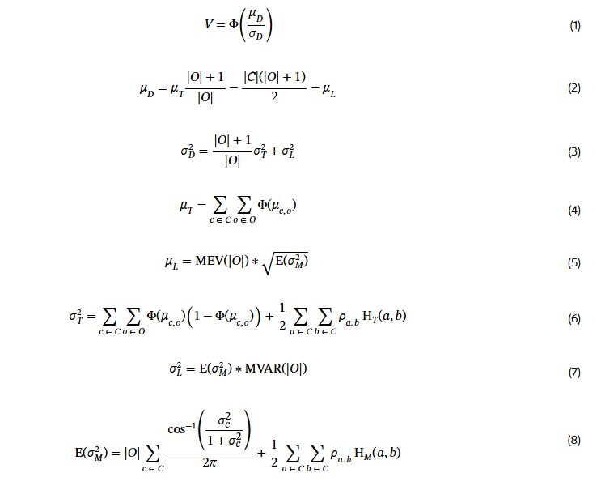

# Rotisserie 

The Rotisserie format is significantly different from the two Head-to-Head formats, necessitating some adaptations.

One simple way in which Rotisserie is different from the other formats is that its scoring period is a full season, instead of a week. That means season-to-season uncertainty is what is important, rather than week-to-week uncertainty. 

The other difference is that Rotisserie requires winning against many managers simultaneously, which adds a layer of complication for H-scoring. An objective function to plug into H-scoring for Rotisserie is described in the [third paper](https://arxiv.org/abs/2501.00933). See the [brief math section](#brief-math) below for a brief explanation of the paper.

## Variance in player performances

Variance in player performances is a key input to the G-score calculation. That means week-to-week variance in the case of Head-to-Head, and uncertainty in season-long performance in the case of Rotisserie. The same quantity is also relevant to H-scoring. While week-to-week variance is relatively simple to estimate based on historical data, pre-season uncertainty is harder to quantify and not studied thoroughly. That creates an issue for using G-scores for Rotisserie in practice.

The website's way of handling this is to use scaled week-to-week variance as a proxy for seasonal uncertainty. The χ factor, which defaults to 60%, controls the degree of scaling. It is one of the [input parameters](parameters.md/#chi-factor).

More technically: the assumption is that the variance over the ~20 weeks in a season will be χ times the week-to-week variance times 20. If week-to-week variance was the only source of variance, χ would be effectively 22%. It is likely higher than that before the season, because there is uncertainty about rotations, playing time, offseason improvements, etc. 60% is an estimate with essentially no justification, it can be changed as desired. 

## H-scores

### Website interface

Because Rotisserie is based on fantasy point totals instead of individual match-up victory probabilities, the H-score display for Rotisserie shows expected category totals instead of average matchup winning probabilities. 

/// caption
Top Rotisserie H-scores, for the 2024-25 season
///

There are a few things to note about this display. 

One is that since overall H-scores in the Rotisserie context are the probability of winning an entire league rather than a single matchup, they tend to be much lower. The average is around 8% instead of 50%. 

Another is that adding up the number of expected fantasy points will lead to a total that appears underwhelming, and unlikely to be enough to win any league. That is because the average outcome is almost always going to be far from enough to actually win. The algorithm is banking on some degree of good luck to have any chance of winning, and that is not reflected in the expected values. 

### General strategy 

It is conventional wisdom that punting is a bad idea in Rotisserie, because winning the entire league essentially requires strong performance in every category. The H-scoring algorithm for Rotisserie largely bears this out, only ever punting Free Throw % for which some players are extreme negative outliers. 

/// caption
Image from the paper. χ set to 50%
///

For the most part, the algorithm aims to be moderately strong in all categories. It does tend to deprioritize volatile categories like Turnovers, though only slightly. It wants to win them, it is just banking on some degree of luck to win those categories, instead of investing heavily in them. It chooses to bank on luck in those categories because they are more volatile than the others, and therefore a small amount of luck will go a longer way.

### Brief math

Warning- math :rotating_light: :abacus: 

The logic behind the Rotisserie algorithm is too complicated to go into fully here

/// caption
Too many symbols
///

But here's the basic idea: 

Say that a team will score $Z$ fantasy points. The expected fantasy point total for an arbitrary opponent algebraically must then be $\frac{P-Z}{|O|}$ where $P$ is the total points up for grabs, and $|O|$ is the number of opponents. 

Say also that the standard deviation of total fantasy points for an arbitrary opponent is known, and can be used to estimate how much better the best opponent will do than the average opponent. Call that value $L$. 

Then, for a given $Z$, the expected difference between the team and its strongest opponent is $Z - \frac{P-Z}{|O|} - L$, or $\frac{Z(|O| - 1)}{|O|} - \frac{P}{|O|} - L$. The overall expected value is $\frac{E(Z)(|O| - 1)}{|O|} - \frac{P}{|O|} - L$

Some additional math can estimate the standard deviation for the difference. Then, it is possible to invoke the Normal CDF to estimate the probability of the difference being positive, which is the team's victory probability. That provides an outer-level objective function for H-scoring. 

This framework provides some intution for why the Rotisserie algorithm tries not to punt categories. The expected value of the difference is generally negative, because it compares the team to its luckiest opponent. The CDF of a negative value of a Normal distiribution will be much higher if the standard deviation is high, since that increases the probability of abberant values. Therefore, the algorithm prefers to have a highly volatile fantasy point total. Punting decreases volatility. It increases confidence in the end result by determining that one category will be lost, and others will likely be won. A balanced team is more volatile, because it could do badly in everything or well in anything. That's the kind of volatility needed to have a strong chance of winning in Rotisserie. 