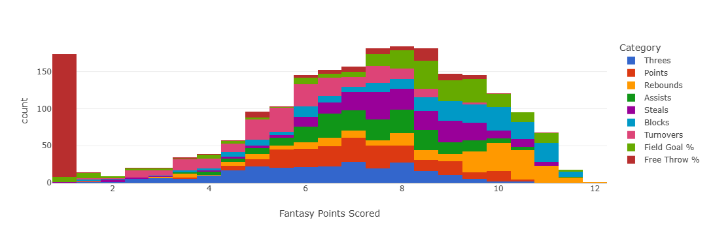

# Rotisserie 

The Rotisserie format is significantly different from the two Head-to-Head formats, necessitating some adaptations.

## Variance in player performances

Variance in player performances is a key input to the G-score calculation. That means week-to-week variance in the case of Head-to-Head, and uncertainty in season-long performance in the case of Rotisserie. The same quantity is also relevant to H-scoring. While week-to-week variance is relatively simple to estimate based on historical data, pre-season uncertainty is harder to quantify and not studied thoroughly. That creates an issue for using G-scores for Rotisserie in practice.

The website's way of handling this is to use scaled week-to-week variance as a proxy for seasonal uncertainty. The χ factor, which defaults to 60%, controls the degree of scaling. It is one of the [input parameters](parameters.md/#chi-factor).

More technically: the assumption is that the variance over the ~20 weeks in a season will be χ times the week-to-week variance times 20. If week-to-week variance was the only source of variance, χ would be effectively 22%. It is likely higher than that before the season, because there is uncertainty about rotations, playing time, offseason improvements, etc. 60% is an estimate with essentially no justification, it can be changed as desired. 

## Adapting H-scores

The H-scoring algorithm for Rotisserie is described in the [third paper](https://arxiv.org/abs/2501.00933). It considers each categorical matchup as a potential fantasy point, because ultimately with Rotisserie scoring every opponent beaten in a category translates to a fantasy point. It then aggregates those individual fantasy points into a distribution of total fantasy points. That distribution is combined with expectations for other teams' fantasy points to calculate the probability that the drafter will end up the highest total. 

Because Rotisserie is based on fantasy point totals instead of individual match-up victory probabilities, the H-score display for Rotisserie shows expected category totals instead of average matchup winning probabilities. 

/// caption
Top Rotisserie H-scores, for the 2024-25 season
///

There are a few things to note about this display. 

One is that since overall H-scores in the Rotisserie context are the probability of winning an entire league rather than a single matchup, they tend to be much lower. The average is around 8% instead of 50%. 

Another is that adding up the number of expected fantasy points will lead to a total that appears underwhelming, and unlikely to be enough to win any league. That is because the average outcome is almost always going to be far from enough to actually win. The algorithm is banking on some degree of good luck to have any chance of winning, and that is not reflected in the expected values. 

## General strategy 

It is conventional wisdom that punting is a bad idea in Rotisserie, because winning the entire league essentially requires strong performance in every category. The H-scoring algorithm for Rotisserie largely bears this out, only ever punting Free Throw % for which some players are extreme negative outliers. 

/// caption
Image from the paper. χ set to 50%
///

For the most part, the algorithm aims to be moderately strong in all categories. It does tend to deprioritize volatile categories like Turnovers, though only slightly. It wants to win them, it is just banking on some degree of luck to win those categories, instead of investing heavily in them. It chooses to bank on luck in those categories because they are more volatile than the others, and therefore a small amount of luck will go a longer way.