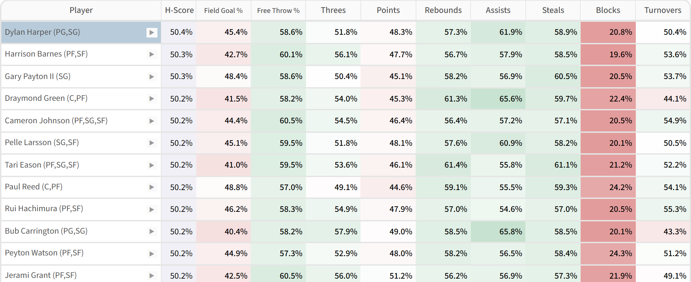
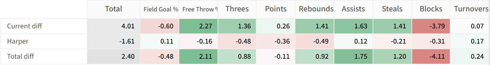
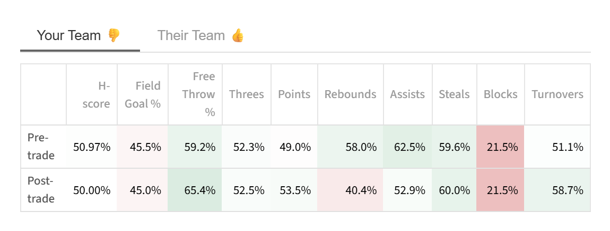
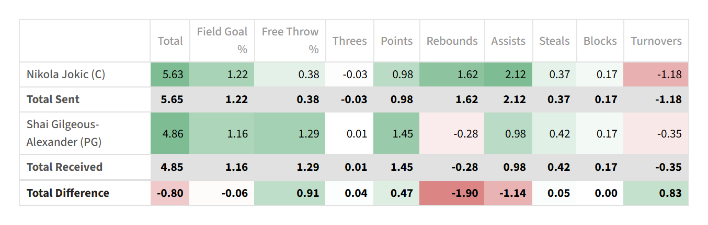
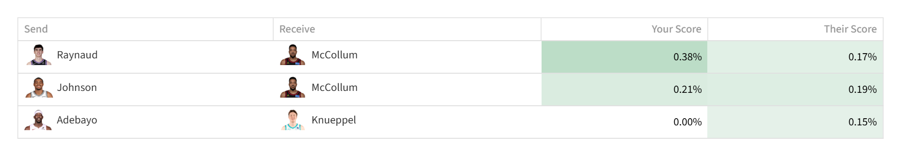
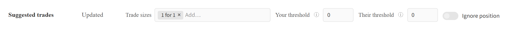
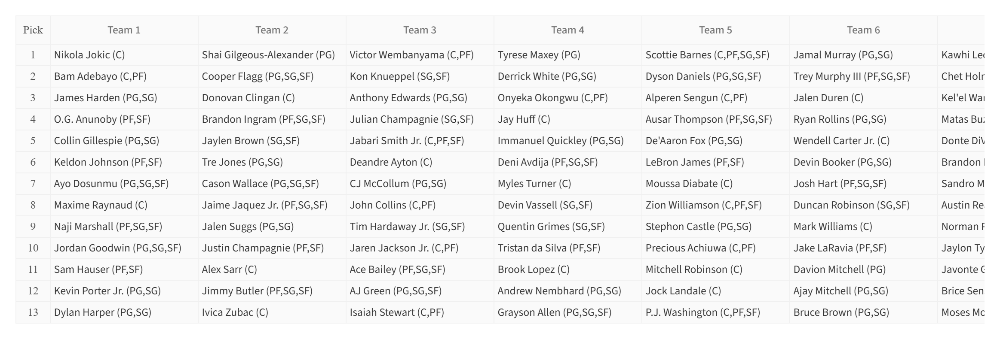
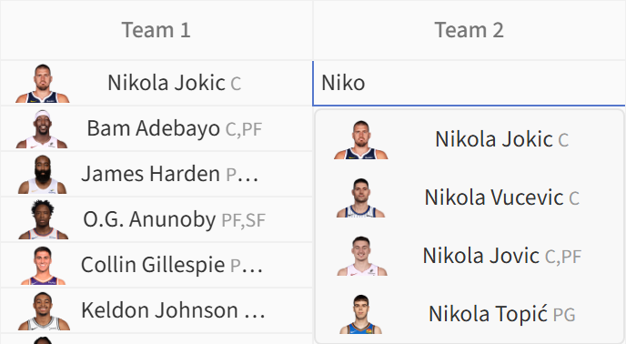
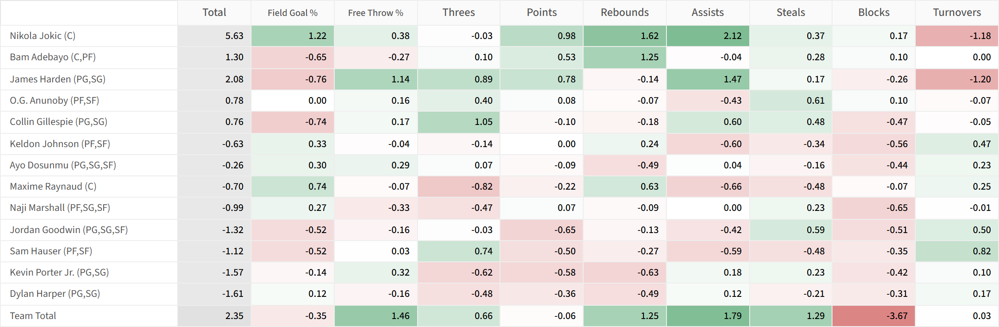
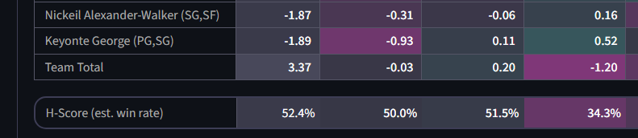

# Season Mode

## Waiver tab 

The waiver wire tab evaluates whether an available player might fit better on an existing team than one of the players already on the team.

/// caption
Substitution H-scores for Team 1, considering dropping its lowest-ranked player, based on the 2025-26 season
///

The player who is a candidate to be dropped is removed from the team, and H-scores are calculated for all available players plus the drop candidate. The drop candidate is highlighted in blue. Players who do not fit the position structure of the team are filtered out and their H-scores are not shown. 

These H-scores are relatively simple to calculate, because all other players are known and there is no need to strategize around future draft picks. For that reason, the algorithm does not iterate at all and results are shown immediately. 

G-score expectation breakdowns are available through the drop-down arrow. Waiver players generally have negative overall G-score value, because they are below average for fantasy. 

/// caption
A breakdown of how Sam Hauser contributes to a team in terms of G-score
///

## Trading tab

The trading tab analyzes the H-score and G-score implications of potential trades. It also provides recommendations for trades. 

### Trade analysis

The trade analysis module analyzes trades proposed by the user. 

The thumbs on the H-score tab for 'Your Team' and 'Their Team' indicate whether a trade improves a team's H-score or not. Thumbs up means the trade is beneficial, thumbs down means the trade is not beneficial. This can also be seen by whether the H-score is higher before or after the trade. 

The methodology for checking a trade is simple. First, players are switched, then both teams are checked for position structure (unless the user specified that position structure should be ignored for trading). If either team is ineligible, then no results will be shown. Otherwise, H-scores are recomputed and compared against the previous H-scores. 

A G-score table is also provided, which shows the net changes in G-scores for both teams by category.

This view is available even if the trade is impermissible by position structure. 

Only trades with the same number of players sent and received can be analyzed. 

??? note "Why can only symmetrical trades be analyzed?"
    In theory asymmetric trades could be analyzed. The post-trade team that goes down in number of players could be scored with the normal H-scoring algorithm, which chooses one candidate from the pool of available players and generates a future draft strategy if needed. The post-trade team that goes up in players could be scored by checking every possible set of players that could be dropped and finding the option that maximizes H-score.

    However, this process is very sensitive to the conditions of the available player pool. For example, if a player has been dropped by another team because he is unlikely to play in the near future, he could still be considered as an addition for the team that drops players. The trade would then look artificially good because H-scoring would jump on that player's optimistic projection. Practically, this makes it difficult to analyze asymmetric trades robustly. For the sake of simplicity the option has been removed. 

### Trade suggestions 

Below the trade analysis module, trade suggestions are shown. 

Which trades end up being shown as suggestions depends on the user-configurable trade parameters. 

Candidate trades are found by iterating through all combinations of possible trades. Those trades are first filtered by a general value difference threshold, which limits candidate trades to those between collections of players whose total general values are similar to each other. Specifically, if the difference in total H-score (calculated for the first pick of a draft, with no players selected) between the two groups of players that are to be traded is above 2%, the trade will not be considered for analysis. E.g. a trade between two 48% players and two 50% players has an H-score difference of 4%, which is above the threshold, so the trade will not be analyzed further. This is to prevent unnecessary computation checking trades that are unlikely to be viable. 

After trades are analyzed for H-score implications, one more filter is applied. Only those which meet the H-score differential thresholds as supplied by the user are shown. 

Even with all this filtering, there can be many possible trades to look through, especially when looking for trades with large numbers of players and when the parameters for acceptable trades are loose. For the purpose of limiting computation time, only 1x1 trades are searched for by default. 2x2 and 3x3 are also available. 

## Rosters tab

### Roster table

Rosters can be manually input or edited on this tab. It is unnecessary if rosters are loaded through a platform integration.

Only players from the loaded dataset can be added to the roster table, which are shown on a searchable drop-down for each cell. The same player can be added multiple times.

/// caption
Nikola Jokic is still shown as an option after already being taken by another team
///

Generally draft results can be copy-pasted from the drafting view into an Excel and then into this table, so long as the dataset of valid players remains the same.

### Roster inspection

On the rosters tab, individual teams can be analyzed in terms of G-score. H-scores are also provided below the table, based on how the team matches up against its opponents. 

