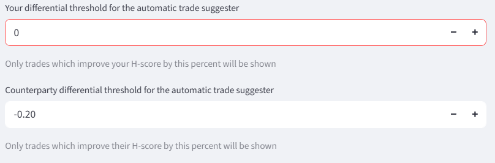
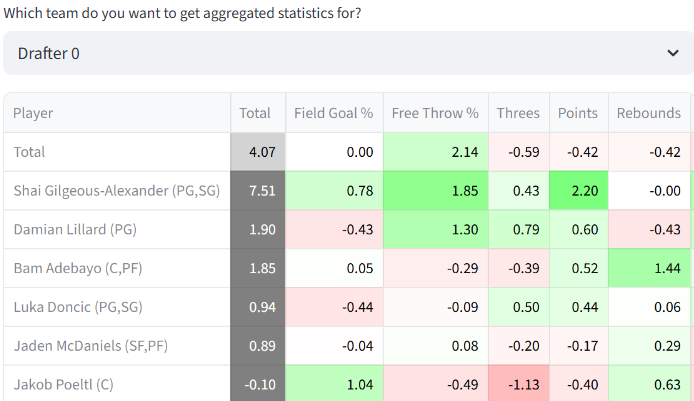

# Season Mode

## Waiver wire & free agents tab 

The waiver wire tab evaluates whether an available player might fit better on an existing team than one of the players already on the team.

/// caption
Substitution H-scores for a synthetic team with Derrick Jones Jr. on it, based on the 2024-25 season
///

The player who is a candidate to be dropped is removed from the team, and H-scores are calculated for all available players plus the drop candidate. The drop candidate is highlighted in blue. Players who do not fit the position structure of the team are filtered out and their H-scores are not shown. 

These H-scores are relatively simple to calculate, because all other players are known and there is no need to strategize around future draft picks. For that reason, the algorithm does not iterate at all and results are shown immediately. The H-score details tab would not be relevant and is not provided. 

A corresponding view is available for G-scores. 

/// caption
G-scores for available players compared to Derrick Jones Jr., based on the 2024-25 season
///

The G-scores shown are the scores of the individual players, not what the scores would be for the team if that player was added. 

## Trading tab

The trading tab analyzes the H-score and G-score implications of potential trades. It also provides recommendations for trades. 

### Trade analysis

The trade analysis module analyzes trades proposed by the user. 

The thumbs on the H-score tab for 'Your Team' and 'Their Team' indicate whether a trade improves a team's H-score or not. Thumbs up means the trade is beneficial, thumbs down means the trade is not beneficial. This can also be seen by whether the H-score is higher before or after the trade. 

Trades in which the same number of players is sent and received are relatively simple to analyze. First, players are switched, then both teams are checked for position structure. If either team is ineligible, then no results will be shown. Otherwise, H-scores are recomputed and compared against the previous H-scores. 

Asymmetrical trades can also be analyzed, though the methodology is more complicated and less reliable. The post-trade team that goes down in number of players is scored with the normal H-scoring algorithm, which chooses one candidate from the pool of available players and generates a future draft strategy if needed. The post-trade team that goes up in players is scored by checking every possible set of players that could be dropped and finding the option that maximizes H-score. The players chosen for addition/removal through these calculations are not shown. 

Because a player gets added during an asymmetrical trade, it is important for asymmetrical trade analysis that the list of available players is accurate. A valuable player that appears to be on the waiver wire will artificially make any trade that goes down in players look beneficial, because it allows for that player to be added. Another consideration is that highly assymetrical trades can take time to process because every possible combination of players to be dropped is being analyzed. 

A G-score table is also provided, which shows the net changes in G-scores for both teams by category.

This view is available even if the trade is impermissible by position structure. 

### Trade suggestions 

Below the trade analysis module, trade suggestions are shown. 

Which trades end up being shown as suggestions depends on the user-configurable [trade parameters](parameters.md/#trade-parameters). 

Candidate trades are found by first heuristically estimating which players might be more favored by the other team, then iterating through all combinations of possible trades with those players. Those trades are further filtered by a general value difference threshold, which is based on user inputs.

The general value thresholds limit candidate trades to those between collections of players whose total general values are similar to each other. If the absolute value of the difference in total general value between the two groups of players that are to be traded is above the threshold, the trade will not be considered for analysis. This is to prevent unnecessary computation checking trades that are unlikely to be viable. 

General value is defined by base H-score (the H-scores the players would have for the first pick of the draft), as a percent. So if the general value threshold is 10, a total base H-score difference of 10% between players is allowed. For asymmetrical trades, the general value of an empty slot is the replacement-level base H-score. 

Thresholds should generally be lower for trade configurations with larger numbers of players involved, because those require checking many more combinations of players. Decreasing the limit and excluding more potential trades limits computation time. 

Trade suggestions can be generated for any kind of trade for which a general strength difference threshold is provided. By default 1x1, 2x2, and 3x3 trades are included, and users can add more through the trade parameters popover. 

After trades are analyzed for H-score implications, one more filter is applied. Only those which meet the H-score differential thresholds as supplied by the user are shown. 

The thresholds are in terms of H-score as a percentage, so if the threshold for a party is -0.2, then trades that decrease the party's H-score by more than 0.2% are not shown. 

Even with all this filtering, there can be many possible trades to look through, especially when looking for trades with large numbers of players and when the parameters for acceptable trades are loose. For the purpose of limiting computation time, only 1x1 trades are searched for by default. 

## Rosters tab

### Roster table

Rosters can be manually input or edited on this tab. It is unneccesary if rosters are loaded through a platform integration.

Information from the roster table will only flow through to other components after the 'Lock in' button is pressed. This is to prevent the website from continually updating itself while many players are being added at the same time. 

Only players from the loaded dataset can be added to the roster table, which are shown on a searchable drop-down for each cell. The same player can be added multiple times.

/// caption
Nikola Jokic is still shown as an option after already being taken by another team
///

Generally draft results can be copy-pasted from the drafting view into an Excel and then into this table, so long as the dataset of valid players remains the same. Occasionally there are bugs with copy-pasting into the rosters table, such as the first column not being copied over. In that case, the few remaining players can be entered by hand. 

### Roster inspection

Individual teams can be analyzed in terms of G-score. H-scores are not provided in this view. 