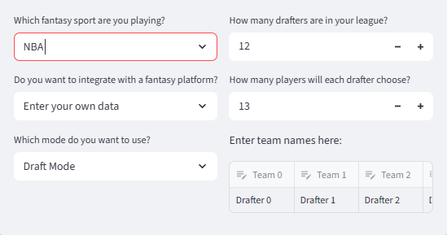
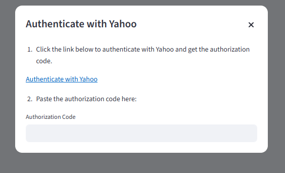
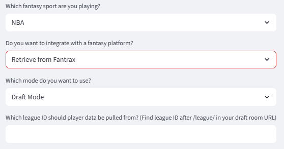
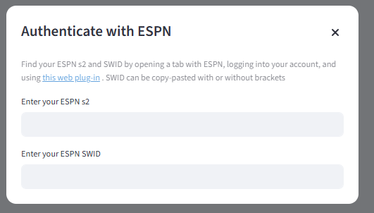
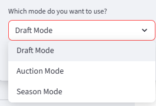
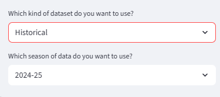
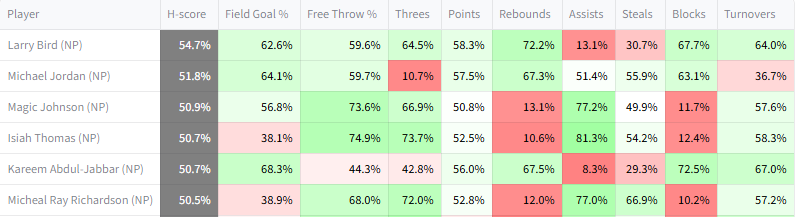
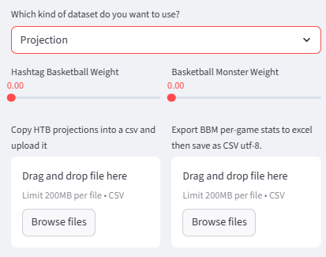
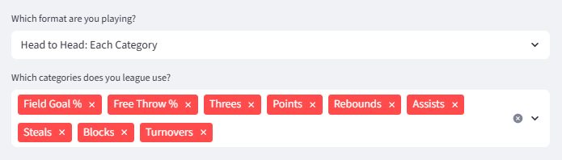
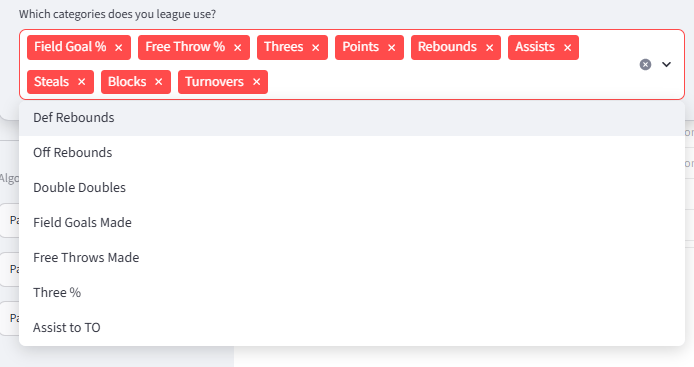

# Settings

Settings are available for live connections to fantasy providers, customizable projection uploads, and adapting to different kinds of scoring. They are accessible via the left sidebar.

## League settings

### Fantasy sport

For now, this will just be NBA. MLB or WNBA may be added in the future

### Data integration 

The default option for getting data on drafting situation/teams is entering it manually. 

There is also an option for integrating with a fantasy provider, which allows the website to be used with real fantasy occuring on those platforms. The website will show analysis based on the integrated league. It will never make a pick or take any action itself. 

The three platforms currently supported are: 

**Yahoo**: support exists both for pulling existing teams during the season, and for integrating with drafts. This includes mock drafts. To integrate, one must authenticate with Yahoo by following the link on the pop-up generated when Yahoo is selected.

Once the connection is established, relevant leagues will show up, if any. Mock drafts can also be connected to via manually copy-pasting the code for the mock draft.

**Fantrax**: support exists both for pulling existing teams during the season, and for integrating with drafts. However this only works with public drafts. 

**ESPN**: support only exists for pulling existing teams during the season. Unfortunately, ESPN has no API for draft access. To authenticate to pull a team, a web plug-in is needed. The instructions are on the pop-up generated when ESPN is selected. 

### Mode 

There are three available modes. 

**Draft mode**: for standard drafts. When drafted players are input manually, only snake drafts are naturally supported. If the drafted players are being pulled via an integration, the website will continually evaluate the best prospects regardless of draft position, so any drafting order will work fine. 

**Auction mode**: for auction drafts. Users must specify that they are doing an auction for either manual entry or platform integration.

**Season mode**: for leagues where teams have already been built. Season mode allows for the inspection of potential free agents, and also includes a trading module. 

### Other info

If draft data is being input manually, the number of drafters, the number of picks per drafter, and the team names of the drafters are also inputs. 

## Player statistics 

Player statistics are an input to the algorithms implemented by the website. They can be sourced either from old seasons or forward-looking projections.

### Historical 

Historical data is available going all the way back to the 1984-85 season, though for any season before 2000-01 player positions will not be available. 

/// caption
H-scores for the 1984-85 season, Each Category. NP means no position
///

Historical data cannot be used when integrated with a fantasy platform, because platforms do not run leagues based on past seasons.  

### Projection

The other option is to use a projection for future performance. 

As of now, two kinds of projections are supported: those created by Hashtag Basketball, and Basketball Monster. Both of these projections are paid products, so they cannot be provided through the website. Instead, they must be purchased and uploaded. They can both be uploaded and then mixed according to the chosen weights, if desired. If the assigned weights add up to more or less than 1, they will be scaled to add to 1. This setup is future-proofing for additional projection sources in the future.

For HTB, there is no native download option for projections. The projections must be copy pasted into an Excel file and saved as a CSV.

For BBM, there is a download option, but only the XLSX download option works. Download it, copy out the projections into Excel, and save them as a CSV UTF-8.

Either kind of projection can be manually edited to change projections if desired. 

Also: be careful to download projections for all players instead of just the top players. During a draft, another drafter may take a player outside of the limited projection list, and the website will only have projections for them if they have been provided. 

## Formats & categories

The website supports the three common category formats for fantasy basketball: H2H Each Category, H2H Most Categories, and Rotisserie. It does not have native support any additional variants, like using a specific category as a tiebreaker. 

It also supports any combination of categories, across the default nine categories and several alternative options.

For the alternative categories, when using projections, make sure to include them when sourcing the projections. 